<center> <h1>🐣 IBM IT Automation - Demo-in-a-Box</h1> </center>


<center> <h2>Demo Environment Installation 🚀</h2> </center>
<BR>
<center> ©2024 Niklaus Hirt / IBM </center>

 

<div style="page-break-after: always;"></div>


<BR>

## Changelog

- Support for 4.8
- Topology Stability
- LAGS stability
- New Elasticsearch instance


<BR>

### ⚠️ Disclaimer

<details>
<summary>Read...</summary>


> ### ❗ This is provided `as-is`:
> 
> * I'm sure there are errors
> * I'm sure it's not complete
> * It clearly can be improved
> 
> 
> Please contact me if you have feedback or if you find glitches or problems.
> 
> - on Slack: @niklaushirt or
> - by Mail: nikh@ch.ibm.com
> 
> 
> **❗The installation has been tested on OpenShift 4.16 on:**
> 
> - OpenShift Cluster (OCP-V) - IBM Cloud (https://techzone.ibm.com/my/reservations/create/66576e78d3aaab001ef9aa8d)
> - OpenShift VMWare Cluster - UPI - Deployer - V2 (https://techzone.ibm.com/collection/tech-zone-certified-base-images/journey-pre-installed-software)
>
> But it should work on other Openshift Platforms as well (ROKS, Fyre, ...)
> 
> 
> 
> ❗ Those are **non-production** installations and are suited only for demo and PoC environments. 
> ❗ Please refer to the official IBM Documentation for production ready installations.

</details>

<div style="page-break-after: always;"></div>

---------------------------------------------------------------
# 0. Introduction
---------------------------------------------------------------

The idea of this repo is to provide an optimised, complete, pre-trained `🐣 Demo-in-a-Box` environments for IBM IT Automation Solutions that are self-contained (e.g. can be deployed in only one cluster)

<details>
<summary>Details...</summary>

> It contains the following components (which can be installed independently):
> 
>  - **IBM AIOps**
>  - **IBM AIOps Demo Content**  (optional)
>     - **OpenLDAP** & Register with IBM AIOps
>     - **Runbooks** AWX (Open Source Ansible Tower) with preloaded Playbooks and AIOps Runbooks
>     - **AI Models** - Load and Train 
> 	    - Load Training Data (LAGS, SNOW, MET, TG) 
>       - Create Training Definitions (TG, LAGS, CR, SI, MET. Turn off RSA) 
>       - Train Models (TG, LAGS, CR, SI, MET) 
>     - **Topology**
>       - Live Demo Apps (RobotShop. SockShop)
>       - Create IBM AIOps Topology and Applications (RobotShop. SockShop, ACME, London Underground, Telecom FiberCut)
>		- Dedicated DemoUI that allows you to trigger different scenarios
>		- Custom Icons (styling and dynamic)
>     - **Configs**
>		- Policies for Incident creation
>		- Custom Alert View
>
>  - **IBM Concert** 
>  - **IBM Concert Demo Content** 
> 
>  - **IBM Turbonomic** 
>  - **IBM Turbonomic Demo Content** 
> 
>  - **IBM Instana** 
>  - **IBM Instana Demo Content** 

> #### ⚠️ **This method creates an in-cluster installation**
> 
> - It's way faster
> - You don't have to install all the tooling locally
> - You don’t need a connection to the cluster during the installation (fire and forget)
> 
> 🤓 So this could basically be done from an iPhone or iPad	

</details>


## 🚀 Getting Started

Basically:

* Get an OpenShift Cluster
* Get your entitlement key/pull token
* Paste the install file into the OpenShift web UI and insert your entitlement key
* Grab a coffe and come back after 2-3 hours depending on the modules you're installing


### 🐥 Quick Install

- 🚀 [Quick Install - CP4AIOps](#21--install-ibm-aiops-with-demo-content)
- 🚀 [Quick Install - IBM Concert (experimental)](#22--install-ibm-concert-with-demo-content)
- 🚀 [Quick Install - IBM Turbonomic](#23--install-ibm-turbonomic-with-demo-content)
- 🚀 [Quick Install - IBM Instana (experimental)](#24--install-ibm-instana-with-demo-content)

- 🧨 [Troubleshooting](#4-troubleshooting)
- 🚀 Already have a cluster? [Dive right in](#21--install-ibm-aiops-with-demo-content)


### 🐥 IBM AIOps specific
- 🚀 [Demo the Solution](#31-demo-the-solution)
- 🤓 [Demo Setup - Explained](#32-demo-setup---explained)
- 📦 [Create a custom Scenario](#33-demo-setup---explained)


<div style="page-break-after: always;"></div>


---------------------------------------------------------------
# 1. Preparation
---------------------------------------------------------------


<div style="page-break-after: always;"></div>

<details>
<summary>✅ Prerequisites</summary>

## 1.1 Prerequisites 


### 1.1.1 Get an OpenShift Cluster (IBMers and IBM Partners only)


1. Get a temporary cluster from **Techzone**
	- OpenShift Cluster (OCP-V) - IBM Cloud (https://techzone.ibm.com/my/reservations/create/66576e78d3aaab001ef9aa8d)
	- OpenShift VMWare Cluster - UPI - Deployer - V2 (https://techzone.ibm.com/collection/tech-zone-certified-base-images/journey-pre-installed-software)

	- 4x worker nodes with **32 CPU / 128 GB**  ❗

	- 3x worker nodes with **16 CPU / 64 GB**  for IBM Concert❗


	You **might** get away with less if you don't install some components but no guarantee.

1. Create a cluster for `Practice/Self Education` or `Test` if you don't have an Opportunity Number (Screenshots are slightly outdated and are different for the different TechZone offerings but the basic choices remain the same)

	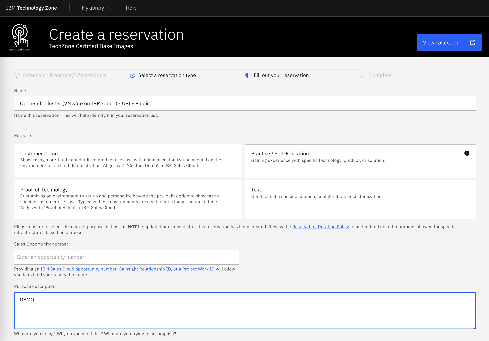

1. Select your preferred Geograpy


1. Select the maximum end date that fits your needs (you can extend the duration once after creation)

	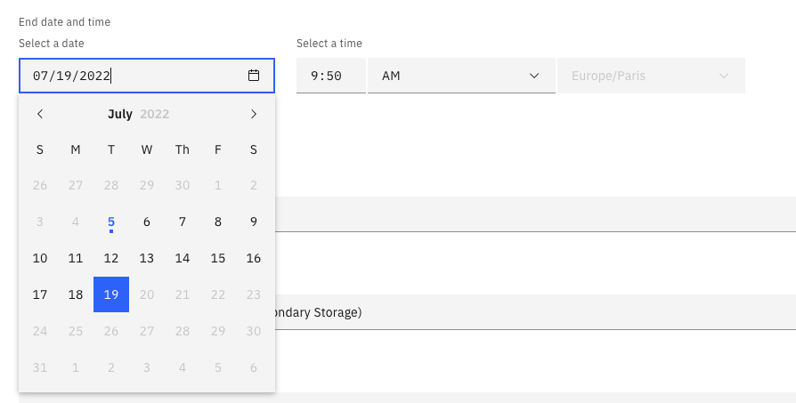 

1. Select Openshift Storage

   - Storage OCS/ODF Size: **1TB** or Managed NFS **2TB**

   - OpenShift Version: **4.15** or **4.16**

  	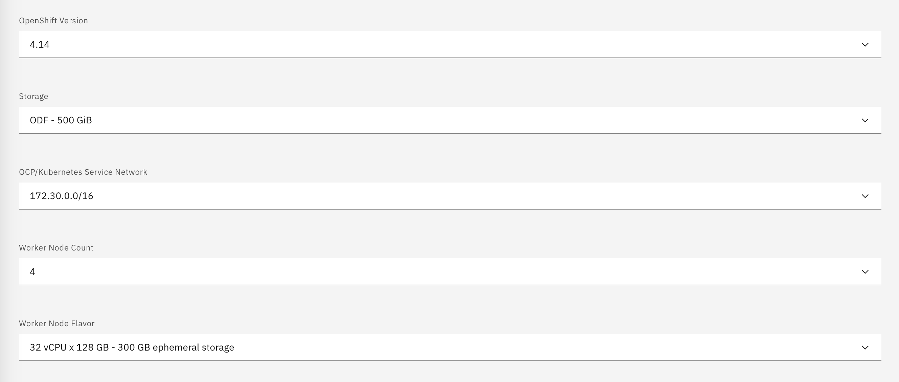

1. Select the Cluster Size

	- Worker node count: **4**
	- Flavour: **32 vCPU X 128 GB** ❗ 

	> ❗ If you want to install IBM AIOps and Trubonomic you must select **5 x 32 vCPU X 128 GB** 


1. Click `Submit`
1. Once the cluster is provisioned, don't forget to extend it as needed.


### 1.1.2 Get the entitlement key (registry pull token) 

You can get the entitlement key (registry pull token) from [https://myibm.ibm.com/products-services/containerlibrary](https://myibm.ibm.com/products-services/containerlibrary).

This allows the images to be pulled from the IBM Container Registry.

<div style="page-break-after: always;"></div>

</details>
<details>
<summary>⚠️ Important remarks before you start</summary>

## ⚠️⚠️ 1.2 Important remarks before you start ⚠️⚠️

Those are remarks to feedback and problem reports I got from the field.

Those scripts have been tested thoroughly on different environments and have proven to be VERY reliable.

If you think that you hit a problem:

* If you have provisioned a cluster with `Managed NFS 2TB` and you have Pods in `0/0` state verify the `nfs-provisioner` Pod is running. If not (this is a bug in Techzone) please apply `./tools/98_maintenance/troubleshooting/nfs-provisioner.yaml`. The installation should subsequently continue. If not, please [re-run the installer Pod](#re-run-the-installer).
* Make sure that you have provisioned a cluster with **4 worker nodes with 32 CPU and 128 GB** each. If you have Pods in `0/0` state verify the `Events`. If you get `Not enough CPU` then delete the cluster and provision the correct size.
* If you want to install IBM AIOps and Turbonomic you **must** select **5 worker nodes with 32 CPU and 128 GB**
* The complete installation takes about 1.5 to 8 hours depending on your region where and the platform you deployed to.
* If you see Pods in `CrashLoop` or other error states, try to wait it out (this can be due to dependencies on other componenets that are not ready yet). Chances are that the deployment will eventually go through. If after 8h you are still stuck, ping me.
### ❗ So simply put be patient and make sure you have the correct size of cluster provisioned!

### ❗ If you encounter problems or missing stuff in your demo environment (no training, no topology, no runbooks, ...) you can re-run the installer by deleting the installer Pod. **The install scripts are NON DESTRUCTIVE** and can be run as many times as you like without corrupting/destroying anything.


<div style="page-break-after: always;"></div>

</details>


---------------------------------------------------------------
# 2. Quick Install
---------------------------------------------------------------


## 2.1 🐣 Install IBM AIOps with demo content

#### 🚀 Get IBM AIOps installed and pre-trained in one simple script.

Here is a quick video that walks you through the installation process


<details>
<summary>📦 2.1.1 What will be installed</summary>

This installation contains:

> - **IBM AIOps**
> 	- IBM Catalog
> 	- IBM Operator
> 	- IBM AIOps Instance
> - **IBM AIOps Demo Content**
>    - **OpenLDAP** & Register with IBM AIOps
>    - **AWX** (Open Source Ansible Tower) with preloaded Playbooks
>    - **AI Models** - Load and Train 
>      - Create Training Definitions (TG, LAGS, CR, SI. Turn off RSA) 
>      - Create Training Data (LAGS, SNOW) 
>      - Train Models (TG, LAGS, CR, SI) 
>    - **Topology**
>      - RobotShop Demo App
>      - SockShop Demo App
>      - ACME Air Demo App
>      - Create K8s Observer
>      - Create ASM merge rules
>      - Load Overlay Topology
>      - Create IBM AIOps Application
>    - **Misc**
>	   - Policies for Incident creation
>	   - Custom Alert View
> 	   - Creates valid certificate for Ingress (Slack) 
> 	   - External Routes (Flink, Topology, ...)
> 	   - Disables ASM Service match rule 
> 	   - Create Policy Creation for Stories and Runbooks 
> 	   - Demo Service Account 
> 

<div style="page-break-after: always;"></div>

</details>

</details>


<details>
<summary>🚀 2.1.2 Installation Instructions </summary>


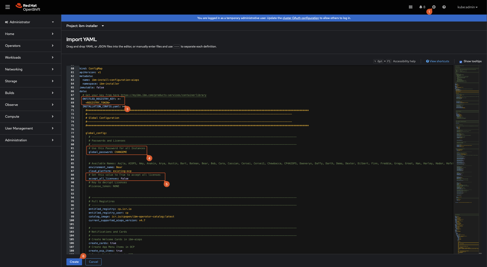

1. In the the OpenShift Web UI click on the `+` sign in the right upper corner
1. Copy and paste the content from [this file](./Quick_Install/00_INSTALL_IBM_AIOPS.yaml)
3. Replace `<REGISTRY_TOKEN>` at the top of the file with your entitlement key from step 1.1.2 (line 69 - the Entitlement key from https://myibm.ibm.com)
3. Replace the default Password `global_password: CHANGEME` with a Password of your choice (line 82, ❗ do NOT use the "-" character and do NOT leave empty ❗)
3. Accept the license by setting `accept_all_licenses` to `True` (line 92)
3. Optionally you can change the name of your Demo Environment  `environment_name` to one of the provided characters (line 89)
3. Click `Create`

> #### ❗ If you get a ClusterRoleBinding already exists, just ignore it
> #### ❗ If you get a warning (Orange or Red Bar on top) please [re-run the installer Pod](#re-run-the-installer) until you are all green.

> #### ❗ If any of the trainings (particularely Temporal grouping or Metric anomaly detection) displays and error, please re-run the training. This is often due to a limit of resources at install time. 


<div style="page-break-after: always;"></div>

</details>


<details>
<summary>🔎 2.1.3 Follow the installation progress</summary>


- The blue Notification at the top gives you basic information about the running Installation (Name, Version, ...)

	

	You can open and follow the installation logs by clicking on `Open Logs` 

	


- In addition to this, you also have the bottom Notifications that give you the current step of the Installation

	


- When the Installation has succeeded, you get the top green Notification bar
	
	
	
	You can directly open the DemoUI by clicking on the link or go to the chapter [Demo the Solution](#3-demo-the-solution) to learn how to run an efficient demo

	And you get this message in the logs

	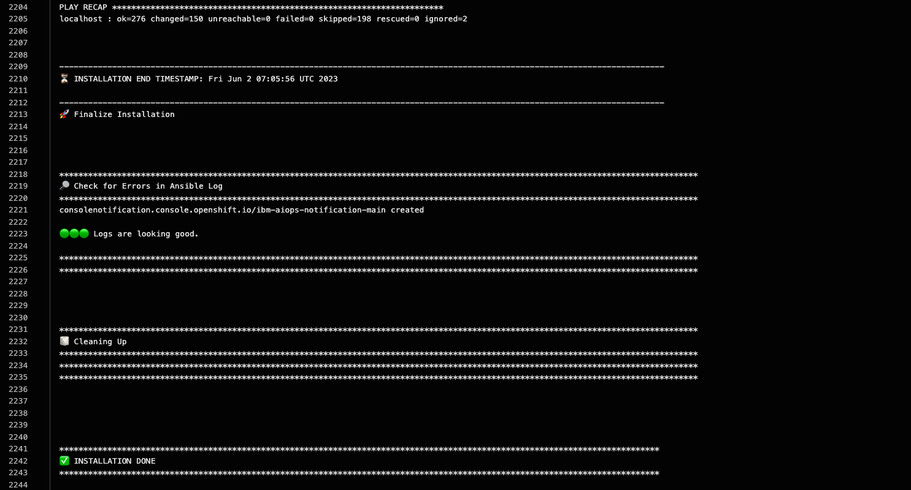


</details>


<details>
<summary>🚀 2.1.4 Connecting for the first time</summary>


### Access the DemoUI

To access the demo environment:

1. In the top green Notification bar click on the link to open the DemoUI

	

1. Login with the provided Password
2. You will find Links and Passwords for all installed components here


<div style="page-break-after: always;"></div>


### Login to IBM AIOps as demo User

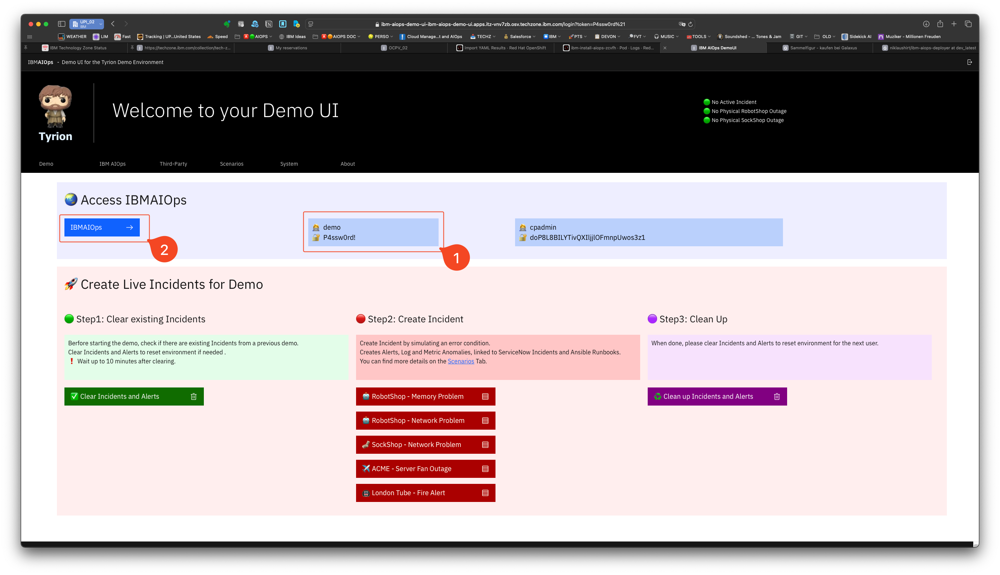

1. Note the Username and Password
2. Click on the blue `IBM AIOps` button
3. Select `Enterprise LDAP` 
3. Login as User `demo` with the Password `Selected at installation` and shown in the DemoUI


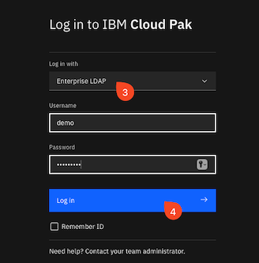


> ❗If you are using IBM TechZone Clusters you will get certificate errors when trying to open CP4AIOPS or Turbonomic
> 
>  ✅ Open the links in a Private/Incognito window and select proceed
> 
> ✅ In Chrome you can type `thisisunsafe`  when on the `Your connection is not private` page. There is no visual feedback but if you type it correctly the page will then load.

</details>

<details>
<summary>✅ 2.1.5 Post Install</summary>

### Check Training
1. In the `IBM AIOps` "Hamburger" Menu select `Operate`/`AI Model Management`
2. Check that the Training are displayed as follows

	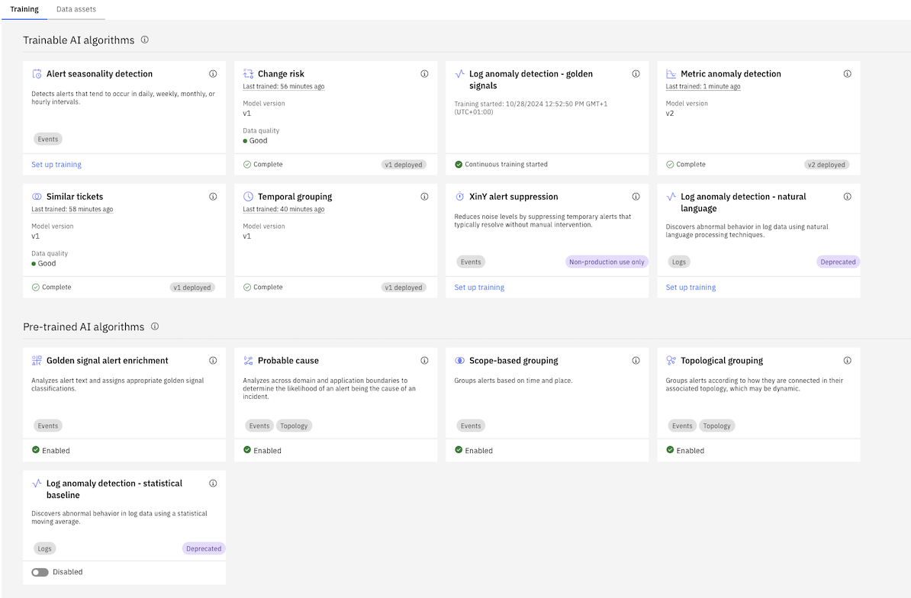


3. If any of the trainings (particularely Metric anomaly detection) displays an error, please re-run the training. This is often due to a limit of resources at install time. 

	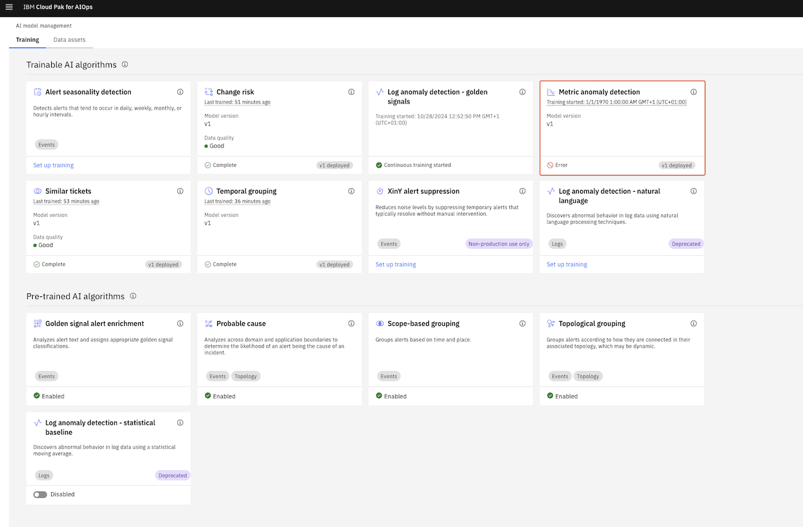

4. Open Training definition and check that the problem was a lack of resources 

	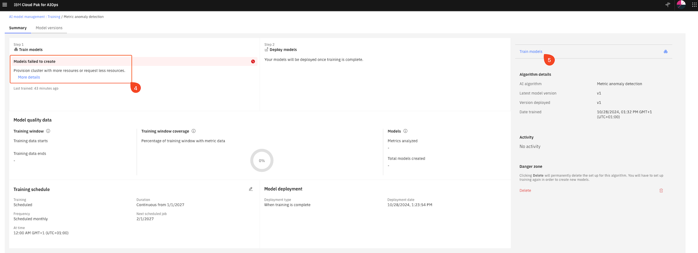

5. Run Training by clicking on `Train Models`

5. You should get around 500+ models

	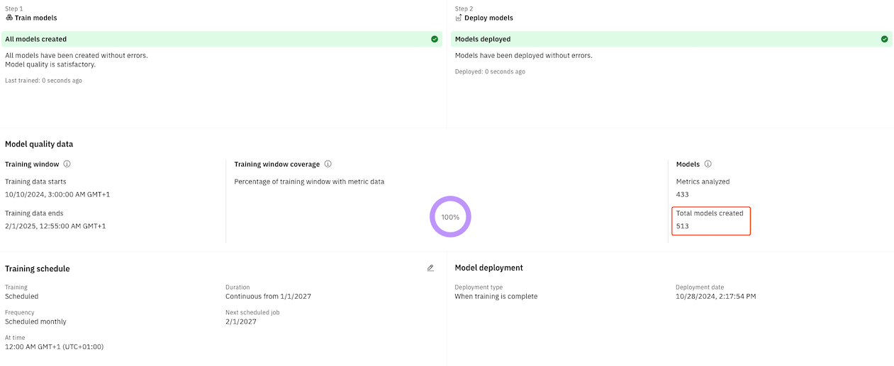

##### ❗ If any of the trainings (particularely Temporal grouping or Metric anomaly detection) displays and error, please re-run the training. This is often due to a limit of resources at install time. 


### Eye Candy


1. In the `IBM AIOps` "Hamburger" Menu select `Operate`/`Alerts`

	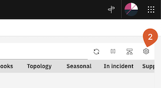

2. Click on the `Cog` on the top right corner
2. Select `User preferences`
4. Select `DEMO Incidents View` for Default view
5. Select `DEMO Incidents View` for Default view for alerts in incidents
6. Enable `Row Coloring` 

	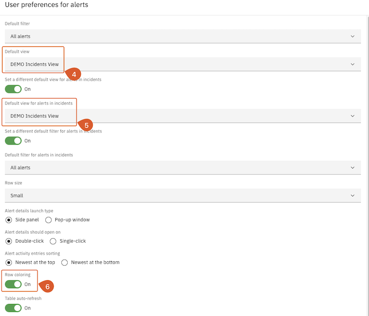


### 🚀 Now you're ready to [Demo the Solution](#31-demo-the-solution)


</details>

<details>
<summary>🔎 2.1.6 Detailed Check</summary>

### ❗ If any of the checks is not right, please refer to [Troubleshooting](#7-troubleshooting)


### 2.1.6.1 Check Overall
Check that the green notification bar is displayed as follows


	
### 2.1.6.2 Check Training
1. In the `IBM AIOps` "Hamburger" Menu select `Operate`/`AI Model Management`
2. Check that the Training are displayed as follows


### ❗ If any of the trainings (particularely Temporal grouping or Metric anomaly detection) displays and error, please re-run the training. This is often due to a limit of resources at install time. 


###  2.1.6.3 Check Automations

#### Check Policies
1. In the `IBM AIOps` "Hamburger" Menu select `Operate`/`Automations`
2. Select the `Policies` Tab
2. Enter `DEMO` into the search field
2. Check that you have 5 Policies as shown below


#### Check Runbooks
1. In the `IBM AIOps` "Hamburger" Menu select `Operate`/`Automations`
2. Select the `Runbooks ` Tab
2. Check that you have 4 Runbooks as shown below


#### Check Actions
1. In the `IBM AIOps` "Hamburger" Menu select `Operate`/`Automations`
2. Select the `Actions ` Tab
3. 2. Enter `DEMO` into the search field
2. Check that you have some Actions present as shown below

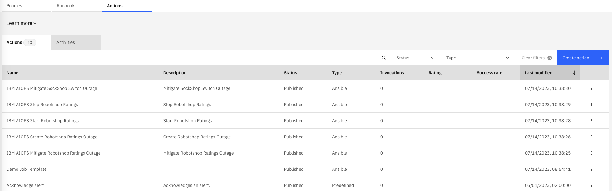

### Check Applications
1. In the `IBM AIOps` "Hamburger" Menu select `Operate`/`Resource management`
2. Check that the Applications are displayed as follows


### Check Connections
1. In the `IBM AIOps` "Hamburger" Menu select `Define`/`Integrations`
2. Check that the Connections are displayed as follows


### ❗ If any of the checks is not right, please refer to [Troubleshooting](#7-troubleshooting)


</details>


<details>
<summary>👩‍💻 2.1.7 Characters to chose from</summary>

In the Quick Install file you can also adapt the Name of your Environment (default is `Bear`)

```yaml
environment_name: Bear
```

You can chose from the following:


*  Adam
*  Aajla
*  AIOPS
*  Alicent
*  Amy
*  Anakin
*  Angus
*  Arya
*  Austin
*  Barney
*  Bart
*  Batman
*  Bear
*  Bob
*  Bono
*  Bran
*  Brienne
*  Cara
*  Cassian
*  Cersei
*  Cersei1
*  Chewbacca
*  CP4AIOPS
*  Curt
*  Daenerys
*  Daffy
*  Darth
*  Demo
*  Dexter
*  Dilbert
*  Edge
*  Finn
*  Fred
*  Freddie
*  Grogu
*  Groot
*  Hagrid
*  Han
*  Harley
*  Harry
*  Hodor
*  Hofstadter
*  Howard
*  Hulk
*  James
*  Jimmy
*  John
*  Joker
*  Jyn
*  King
*  Kirk
*  Kurt
*  Lando
*  Leia
*  Larry
*  Lemmy
*  Liam
*  Luke
*  Nightking
*  Obiwan
*  Padme
*  Paul
*  Penny
*  Picard
*  Prince
*  Raj
*  Rey
*  Robin
*  Robot1
*  Robot2
*  Robot3
*  Robot4
*  Robot5
*  Ron
*  Sabine
*  Sansa
*  Sheldon
*  Sherlock
*  Slash
*  Spiderman
*  Spock
*  Strange
*  Superman
*  Tormund
*  Tyrion
*  Walker
*  Watson
*  Wedge


</details>


## 2.2 🐣 Install IBM Concert with demo content

#### 🚀 Get IBM Concert installed and demo content installed in one simple script.

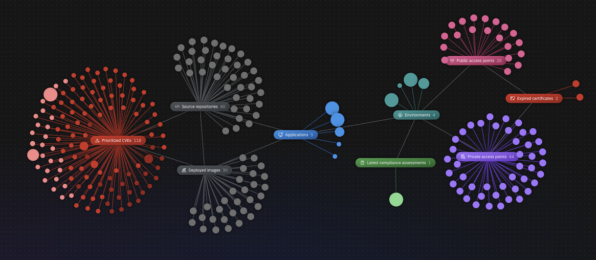


<details>
<summary>📦 2.2.1 What will be installed</summary>

This installation contains:

> - **IBM Concert**
> 	- IBM Concert Instance
> - **IBM Concert Demo Content**
>    - **Default** Demo Content
>    - **SBOMs**
>	   - App, Build and Deploy for RobotShop
>    - **Certificates**
>	   - Certificates for RobotShop
>    - **Compliance**
>	   - Custom NIST Demo Compliance
> - **Demo Applications**
>   - RobotShop Demo App
>   - SockShop Demo App
<div style="page-break-after: always;"></div>

</details>

</details>


<details>
<summary>🚀 2.2.2 Installation Instructions </summary>


1. In the the OpenShift Web UI click on the `+` sign in the right upper corner
1. Copy and paste the content from [this file](./Quick_Install/30_INSTALL_IBM_CONCERT.yaml)
3. Replace `<REGISTRY_TOKEN>` at the top of the file with your entitlement key from step 1.1.2 (line 49 - the Entitlement key from https://myibm.ibm.com)
3. Replace the default Password `global_password: CHANGEME` with a Password of your choice (line 62, ❗ do NOT use the "-" character and do NOT leave empty ❗)
3. Accept the license by setting `accept_all_licenses` to `True` (line 69)
3. Click `Create`

> #### ❗ If you get a ClusterRoleBinding already exists, just ignore it
> #### ❗ If you get a warning (Orange or Red Bar on top) please [re-run the installer Pod](#re-run-the-installer) until you are all green.


<div style="page-break-after: always;"></div>

</details>


</details>


<details>
<summary>🔎 2.2.3 Follow the installation progress</summary>


- The blue Notification at the top gives you basic information about the running Installation (Name, Version, ...)

	You can open and follow the installation logs by clicking on `Open Logs` 


- In addition to this, you also have the bottom Notifications that give you the current step of the Installation


- When the Installation has succeeded, you get the top green Notification bar
	
	You can directly open IBM Concert by clicking on the link 

</details>


## 2.3 🐣 Install IBM Turbonomic with demo content

#### 🚀 Get IBM Turbonomic installed and demo content installed in one simple script.

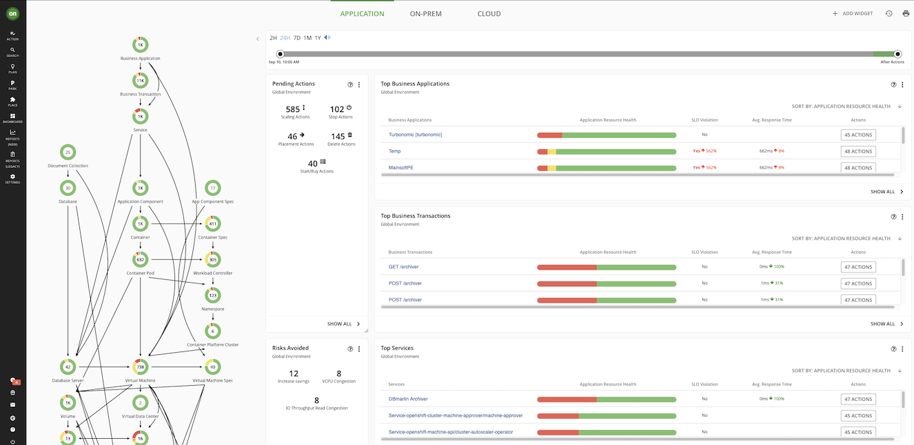


<details>
<summary>📦 2.3.1 What will be installed</summary>

This installation contains:

> - **IBM Turbonomic**
> 	- IBM Turbonomic Instance
> - **IBM Turbonomic Demo Content**
> - **Demo Applications**
>   - RobotShop Demo App
>   - SockShop Demo App

<div style="page-break-after: always;"></div>

</details>

</details>


<details>
<summary>🚀 2.3.2 Installation Instructions </summary>


1. In the the OpenShift Web UI click on the `+` sign in the right upper corner
1. Copy and paste the content from [this file](./Quick_Install/10_INSTALL_IBM_TURBONOMIC.yaml)
3. Enter your Turbonomic License on line 69
3. Replace the default Password `global_password: CHANGEME` with a Password of your choice (line 62, ❗ do NOT use the "-" character and do NOT leave empty ❗)
3. Accept the license by setting `accept_all_licenses` to `True` (line 72)
3. Optionally you can change the name of your Demo Environment  `environment_name` to one of the provided characters (line 69)
3. Click `Create`

> #### ❗ If you get a ClusterRoleBinding already exists, just ignore it
> #### ❗ If you get a warning (Orange or Red Bar on top) please [re-run the installer Pod](#re-run-the-installer) until you are all green.


<div style="page-break-after: always;"></div>

</details>


</details>


<details>
<summary>🔎 2.3.3 Follow the installation progress</summary>


- The blue Notification at the top gives you basic information about the running Installation (Name, Version, ...)

	You can open and follow the installation logs by clicking on `Open Logs` 


- In addition to this, you also have the bottom Notifications that give you the current step of the Installation


- When the Installation has succeeded, you get the top green Notification bar
	
	You can directly open IBM Turbonomic by clicking on the link 

</details>


## 2.4 🐣 Install IBM Instana with demo content

#### 🚀 Get IBM Instana installed and demo content installed in one simple script.

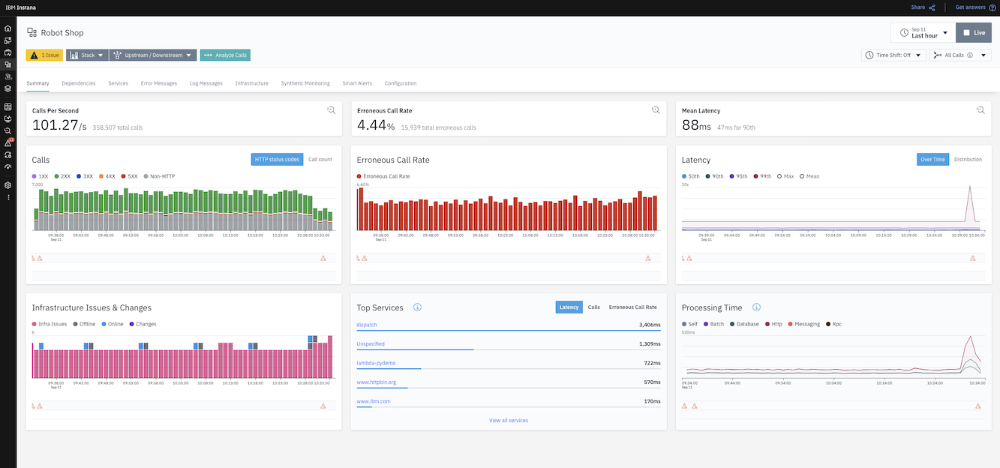


<details>
<summary>📦 2.4.1 What will be installed</summary>

This installation contains:

> - **IBM Instana**
> 	- IBM Instana Instance
> - **IBM Instana Demo Content**
>    - TBD
> - **Demo Applications**
>   - RobotShop Demo App
>   - SockShop Demo App

<div style="page-break-after: always;"></div>

</details>

</details>


<details>
<summary>🚀 2.4.2 Installation Instructions </summary>


1. In the the OpenShift Web UI click on the `+` sign in the right upper corner
1. Copy and paste the content from [this file](./Quick_Install/20_INSTALL_IBM_INSTANA.yaml)
3. Enter your Turbonomic License on lines 142/143
3. Replace the default Password `global_password: CHANGEME` with a Password of your choice (line 60, ❗ do NOT use the "-" character and do NOT leave empty ❗)
3. Accept the license by setting `accept_all_licenses` to `True` (line 70)
3. Optionally you can change the name of your Demo Environment  `environment_name` to one of the provided characters (line 67)
3. Click `Create`

> #### ❗ If you get a ClusterRoleBinding already exists, just ignore it
> #### ❗ If you get a warning (Orange or Red Bar on top) please [re-run the installer Pod](#re-run-the-installer) until you are all green.


<div style="page-break-after: always;"></div>

</details>


</details>


<details>
<summary>🔎 2.4.3 Follow the installation progress</summary>


- The blue Notification at the top gives you basic information about the running Installation (Name, Version, ...)

	You can open and follow the installation logs by clicking on `Open Logs` 


- In addition to this, you also have the bottom Notifications that give you the current step of the Installation


- When the Installation has succeeded, you get the top green Notification bar
	
	You can directly open IBM Instana by clicking on the link 

</details>


---------------------------------------------------------------
# 3. CloudPak for AIOps
---------------------------------------------------------------


---------------------------------------------------------------
## 3.1 Demo the Solution
---------------------------------------------------------------

📹 Please use the [Demo Script](/./doc/storytelling/CP4AIOps%20Live%20Environment%20Sample%20Demo%20Script_NO_CHATOPS.md) to prepare for the demo.

📹 The [Click Through PPT](https://ibm.box.com/s/icgkxzlt2ja6dth16dpdin055uyysej1), provides you with a simple PPT based demo - "feels like the real thing"(TM).

📹 I have also added a short [Demo Walkthrough video](https://ibm.ent.box.com/folder/158722723584?s=icgkxzlt2ja6dth16dpdin055uyysej1) that you can watch to get an idea on how to do the demo (based on 3.2). 


<details>
<summary>🌏 3.1.1 Access the Environment</summary>

### Access the Environment

To access the demo environment:

* Click on the Application Menu <svg fill="currentColor" height="1em" width="1em" viewBox="0 0 512 512" aria-hidden="true" role="img" style="vertical-align: -0.125em;"><path d="M149.333 56v80c0 13.255-10.745 24-24 24H24c-13.255 0-24-10.745-24-24V56c0-13.255 10.745-24 24-24h101.333c13.255 0 24 10.745 24 24zm181.334 240v-80c0-13.255-10.745-24-24-24H205.333c-13.255 0-24 10.745-24 24v80c0 13.255 10.745 24 24 24h101.333c13.256 0 24.001-10.745 24.001-24zm32-240v80c0 13.255 10.745 24 24 24H488c13.255 0 24-10.745 24-24V56c0-13.255-10.745-24-24-24H386.667c-13.255 0-24 10.745-24 24zm-32 80V56c0-13.255-10.745-24-24-24H205.333c-13.255 0-24 10.745-24 24v80c0 13.255 10.745 24 24 24h101.333c13.256 0 24.001-10.745 24.001-24zm-205.334 56H24c-13.255 0-24 10.745-24 24v80c0 13.255 10.745 24 24 24h101.333c13.255 0 24-10.745 24-24v-80c0-13.255-10.745-24-24-24zM0 376v80c0 13.255 10.745 24 24 24h101.333c13.255 0 24-10.745 24-24v-80c0-13.255-10.745-24-24-24H24c-13.255 0-24 10.745-24 24zm386.667-56H488c13.255 0 24-10.745 24-24v-80c0-13.255-10.745-24-24-24H386.667c-13.255 0-24 10.745-24 24v80c0 13.255 10.745 24 24 24zm0 160H488c13.255 0 24-10.745 24-24v-80c0-13.255-10.745-24-24-24H386.667c-13.255 0-24 10.745-24 24v80c0 13.255 10.745 24 24 24zM181.333 376v80c0 13.255 10.745 24 24 24h101.333c13.255 0 24-10.745 24-24v-80c0-13.255-10.745-24-24-24H205.333c-13.255 0-24 10.745-24 24z"></path></svg> in your Openshift Web Console.
* Select `IBM AIOps Demo UI`
* Login with the password `Selected at installation`

	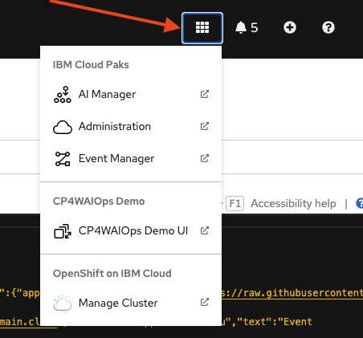


<div style="page-break-after: always;"></div>

</details>
<details>
<summary>🔐 3.1.2 Login to IBM AIOps as demo User</summary>

### Login to IBM AIOps as demo User

* Click on the blue `IBM AIOps` button
* Login as User `demo` with the Password `Selected at installation`


> ❗If you are using IBM TechZone Clusters you will get certificate errors when trying to open CP4AIOPS or Turbonomic
> 
>  ✅ Open the links in a Private/Incognito window and select proceed
> 
> ✅ In Chrome you can type `thisisunsafe`  when on the `Your connection is not private` page. There is no visual feedback but if you type it correctly the page will then load.

</details>
<details>
<summary>🚀 3.1.3Demo the Solution</summary>

### 🚀 Demo the Solution

Please use the [Demo Script](/./doc/storytelling/CP4AIOps%20Live%20Environment%20Sample%20Demo%20Script_NO_CHATOPS.md) to prepare for the demo.

Then start the demo from the same [Demo Script](/./doc/CP4AIOps%20Live%20Environment%20Sample%20Demo%20Script_NO_CHATOPS.md#2-deliver-the-demo).

</details>
<div style="page-break-after: always;"></div>


---------------------------------------------------------------
## 3.2 Demo Setup - Explained
---------------------------------------------------------------


<details>
<summary>📥 3.2.1 Basic Architecture</summary>

### Basic Architecture

The environement (Kubernetes, Applications, ...) create logs that are being fed into a Log Management Tool (ELK in this case).


1. External Systems generate Alerts and send them into the IBM AIOps for Event Grouping.
1. At the same time IBM AIOps ingests the raw logs coming from the Log Management Tool (ELK) and looks for anomalies in the stream based on the trained model.
2. It also ingests Metric Data and looks for anomalies
1. If it finds an anomaly (logs and/or metrics) it forwards it to the Event Grouping as well.
1. Out of this, IBM AIOps creates an Incident that is being enriched with Topology (Localization and Blast Radius) and with Similar Incidents that might help correct the problem.
1. The Incident is then sent to Slack.
1. A Runbook is available to correct the problem but not launched automatically.

<div style="page-break-after: always;"></div>

</details>
<details>
<summary>📥 3.2.2 Optimized Demo Architecture</summary>

### Optimized Demo Architecture

The idea of this repo is to provide a optimised, complete, pre-trained demo environment that is self-contained (e.g. can be deployed in only one cluster)

It contains the following components (which can be installed independently):

 - **IBM AIOps**
 	- IBM Operator
 	- IBM AIOps Instance
 - **IBM AIOps Demo Content**  (optional)
    - **OpenLDAP** & Register with IBM AIOps
    - **AWX** (Open Source Ansible Tower) with preloaded Playbooks
    - **AI Models** - Load and Train 
      - Create Training Definitions (TG, LAD, CR, SI. Turn off RSA) 
      - Create Training Data (LAD, SNOW) 
      - Train Models (TG, LAD, CR, SI) 
    - **Topology**
      - RobotShop Demo App
      - Create K8s Observer
      - Create ASM merge rules
      - Load Overlay Topology
      - Create IBM AIOps Application
    - **Misc**
     	- Creates valid certificate for Ingress (Slack) 
		- External Routes (Flink, Topology, ...)
		- Disables ASM Service match rule 
		- Create Policy Creation for Stories and Runbooks 
		- Demo Service Account 
 - **Turbonomic**  (optional)
 - **Turbonomic Demo Content** (optional)
	- Demo User
	- RobotShop Demo App with synthetic metric
	- Instana target (if Instana is installed - you have to enter the API Token Manually)
	- Groups for vCenter and RobotShop
	- Groups for licensing
	- Resource Hogs


For the this specific Demo environment:

* ELK is not needed as I am using pre-canned logs for training and for the anomaly detection (inception)
* Same goes for Metrics, I am using pre-canned metric data for training and for the anomaly detection (inception)
* The Events are also created from pre-canned content that is injected into IBM AIOps
* There are also pre-canned ServiceNow Incidents if you don’t want to do the live integration with SNOW
* The Webpages that are reachable from the Events are static and hosted on my GitHub
* The same goes for ServiceNow Incident pages if you don’t integrate with live SNOW

This allows us to:

* Install the whole Demo Environment in a self-contained OCP Cluster
* Trigger the Anomalies reliably
* Get Events from sources that would normally not be available (Instana, Turbonomic, Log Aggregator, Metric Provider, ...)
* Show some examples of SNOW integration without a live system


<div style="page-break-after: always;"></div>

</details>
<details>
<summary>📥 3.2.3 Training </summary>

### Training

#### 3.2.3.1 Loading training data


Loading Training data is done at the lowest possible level (for efficiency and speed):

* Logs: Loading Elastic Search indexes directly into ES - two days of logs for March 3rd and 4th 2022
* SNOW: Loading Elastic Search indexes directly into ES - synthetic data with 15k change requests and 5k incidents
* Metrics: Loading Cassandra dumps of metric data - 3 months of synthetic data for 13 KPIs


#### 3.2.3.2 Training the models

The models can be trained directly on the data that has been loaded as described above.


<div style="page-break-after: always;"></div>

</details>
<details>
<summary>📥 3.2.4 Incident creation</summary>

### Incident creation (inception)


Incidents are being created by using the high level APIs in order to simulate a real-world scenario.

* Events: Pre-canned events are being injected through the corresponding REST API
* Logs: Pre-canned anomalous logs for a 30 min timerange are injected through Kafka
* Metrics: Anomalous metric data are generated on the fly and injected via the corresponding REST API
</details>


> ℹ️ You can find a more detailed presentation about how the automation works here: [PDF](https://ibm.box.com/s/gx0tcubl9k4phvdsrffd7taragrmvz02).


<div style="page-break-after: always;"></div>

---------------------------------------------------------------
## 3.3 Custom Scenarios
---------------------------------------------------------------

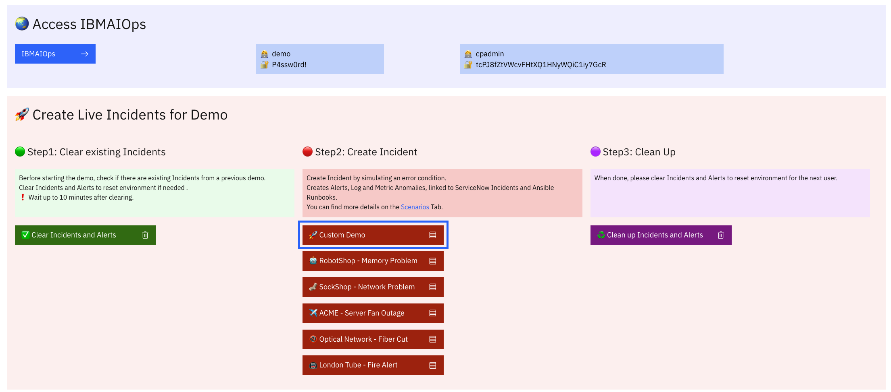

This feature allows you to easily create custom scenarios for the IBM AIOps Demo UI.

By default the custom scenario is disabled. In order to enable it you have to modify the `ibm-aiops-demo-ui-config-custom` ConfigMap in the `ibm-aiops-demo-ui` Namespace.

> ℹ️ The Topology will be loaded only the first time. Once the Application exists it will not update.
>
> ℹ️ If you want to update the Topology after a modification of the CustomMap, you can use the `Reload Topolgy` Button on the `About` Tab.


### 3.3.1 📥 Custom Scenario Parameters

<details>
<summary>📥 Topology</summary>

#### 3.3.1.1 Topology

To create a complete Topology/Application, you have to define the following variables:

- `CUSTOM_TOPOLOGY_APP_NAME` : Name for the Application (if this is left empty, no Application is created)
- `CUSTOM_TOPOLOGY_TAG` : Tag used to create the Topology Template (if this is left empty, no Template is created)
- `CUSTOM_TOPOLOGY`: Topology definition, will be loaded through a File Explorer (make sure that you have a corresponding tag to create the Template)

❗ IMPORTANT: The complete topology is loaded each time the DemoUI Pod is restarting


#### 🛠️ Format


You can get more details [here](https://www.ibm.com/docs/en/cloud-paks/cloud-pak-aiops/4.4.0?topic=jobs-file-observer).

A typical Vertex (Entity)

```json
 V:{
   "name": "test01", "uniqueId": "test01-id",
   "entityTypes": ["device"], 
   "matchTokens":["test01","test01-id"],                         <-- This should contain the resource name of the event to be matched to 
   "mergeTokens":["test01","test01-id"],				         
   "tags":["tag1","app:custom-app"], "app":"test" ,
   "city":"Richmond", "area": "Broad Meadows", "geolocation": { "geometry": { "coordinates": [-77.56121810464228, 37.64360674606608],"type": "Point"}},
   "_references": [{"_toUniqueId":"test02-id","_edgeType":"connectedTo"}],
   "fromFile":"true", "_operation": "InsertUpdate"
  }
```


      </details>


</details>


<details>
<summary>📥 Events</summary>         

#### 3.3.1.2 Events

Inject Events to simulate the Custom Scenario.

- `CUSTOM_EVENTS` : List of Events to be injected sequentially (order is being respected)


#### 🛠️ Format

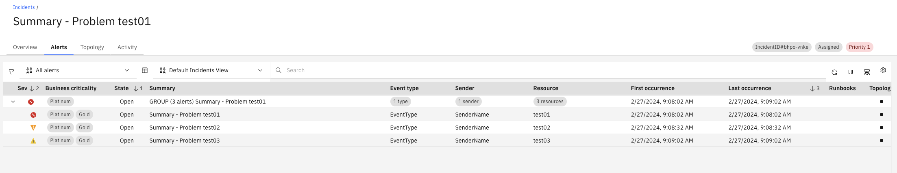


```json
{
	"id": "1a2a6787-59ad-4acd-bd0d-000000000000",    <-- Optional
	"occurrenceTime": "MY_TIMESTAMP",                <-- Do not modify
	"summary": "Summary - Problem test01",           <-- The text of the event
	"severity": 6,
	"expirySeconds": 6000000,
	"links": [{
		"linkType": "webpage",
		"name": "LinkName",
		"description": "LinkDescription",
		"url": "https://ibm.com/index.html"
	}],
	"sender": {
		"type": "host",
		"name": "SenderName",
		"sourceId": "SenderSource"
	},
	"resource": {
		"type": "host",
		"name": "test01",                            <-- This is the resource name that will be matched to Topology (see MatchTokens)
		"sourceId": "ResourceSorce"
	},
	"details": {
		"Tag1Name": "Tag1",
		"Tag2Name": "Tag2"
	},
		"type": {
		"eventType": "problem",
		"classification": "EventType"
	}
}

```

		 </details>


</details>


<details>
<summary>📥 Metrics</summary>

#### 3.3.1.3 Metrics

Inject Metrics to simulate the Custom Scenario.

- `CUSTOM_METRICS` : List of Metrics to be simulated

❗ IMPORTANT: You need a trained Metric Model for this to create anomalies


#### 🛠️ Format


You can get more details [here](https://www.ibm.com/docs/en/cloud-paks/cloud-pak-aiops/4.4.0?topic=apis-metric-api).


`ResourceName, MetricName, GroupName, BaseValue, Variance?

- ResourceName: The resource name that will be matched to Topology (see MatchTokens)
- MetricName: Name of the Metric  (ex. MemoryUsageAverage)
- GroupName: Name of the Metric Group  (ex. MemoryUsage)
- Base Value: Mean value
- Variance: Variance around mean value

Example: 
- MeanValue: 97
- Variance: 3
- Will create random values between 94 and 100


```
test10,DemoMetric1,DemoGroup1,0,1;
test11,DemoMetric2,DemoGroup2,50,25'
```

		 </details>


</details>


<details>
<summary>📥 Logs</summary>

#### 3.3.1.4 Logs

Inject Logs to simulate the Custom Scenario.

- `CUSTOM_LOGS` : List of Log lines to be injected sequentially (order is being respected)

❗ IMPORTANT: You need a trained Log Model for this to create anomalies


#### 🛠️ Format

A typical Vertex (Entity)

```json
{
    "timestamp": MY_EPOCH,                           <-- Do not modify
    "utc_timestamp": "MY_TIMESTAMP",                 <-- Do not modify
    "instance_id": "test20",                         <-- This is the resource name that will be matched to Topology (see MatchTokens)
    "message": "Demo Log Message",                   <-- The text of the log line
    "entities": {
        "pod": "test20",
        "cluster": null,
        "container": "test20",
        "node": "test21"
    },
    "application_group_id": "1000",
    "application_id": "1000",
    "level": 1,
    "type": "StandardLog",
	"features": [],
    "meta_features": []
}

```


</details>

<details>
<summary>📥 Logs</summary>

#### 3.3.1.5 Property Change

Simulate change in an Topology Objects Propoerties.

- `CUSTOM_PROPERTY_RESOURCE_NAME` : The Name of the resource to be affected 
- `CUSTOM_PROPERTY_RESOURCE_TYPE` : The Type of the resource to be affected
- `CUSTOM_PROPERTY_VALUES_NOK` : The values to be added/created when the Incident is being simulated
- `CUSTOM_PROPERTY_VALUES_OK` : The values to be added/created when the Incident is being mitigaged


#### 🛠️ Format

A typical Entry

```yaml
  CUSTOM_PROPERTY_RESOURCE_NAME: 'test01'
  CUSTOM_PROPERTY_RESOURCE_TYPE: 'device'
  CUSTOM_PROPERTY_VALUES_NOK: '{"test1": "NOK","test2": "NOK","test3": "NOK"}'
  CUSTOM_PROPERTY_VALUES_OK: '{"test1": "OK","test2": "OK","test3": "OK"}'
}

```


</details>


### 3.3.2 📥 Example

<details>
<summary>📥 Example</summary>


This is a small example containing a Topology, Events, Metrics and Logs.

```yaml
kind: ConfigMap
apiVersion: v1
metadata:
  name: ibm-aiops-demo-ui-config-custom
  namespace: ibm-aiops-demo-ui
data:
  CUSTOM_NAME: 'Custom Demo'
  CUSTOM_EVENTS: |-
    { "id": "1a2a6787-59ad-4acd-bd0d-000000000000", "occurrenceTime": "MY_TIMESTAMP", "summary": "Summary - Problem test01", "severity": 6, "type": { "eventType": "problem", "classification": "EventType" }, "expirySeconds": 6000000, "links": [ { "linkType": "webpage", "name": "LinkName", "description": "LinkDescription", "url": "https://pirsoscom.github.io/git-commit-mysql-vm.html" } ], "sender": { "type": "host", "name": "SenderName", "sourceId": "SenderSource" }, "resource": { "type": "host", "name": "test01", "sourceId": "ResourceSorce" }, "details": { "Tag1Name": "Tag1", "Tag2Name": "Tag2" }}
    { "id": "1a2a6787-59ad-4acd-bd0d-000000000000", "occurrenceTime": "MY_TIMESTAMP", "summary": "Summary - Problem test02", "severity": 5, "type": { "eventType": "problem", "classification": "EventType" }, "expirySeconds": 6000000, "links": [ { "linkType": "webpage", "name": "LinkName", "description": "LinkDescription", "url": "https://pirsoscom.github.io/git-commit-mysql-vm.html" } ], "sender": { "type": "host", "name": "SenderName", "sourceId": "SenderSource" }, "resource": { "type": "host", "name": "test02", "sourceId": "ResourceSorce" }, "details": { "Tag1Name": "Tag1", "Tag2Name": "Tag2" }}
    { "id": "1a2a6787-59ad-4acd-bd0d-000000000000", "occurrenceTime": "MY_TIMESTAMP", "summary": "Summary - Problem test03", "severity": 4, "type": { "eventType": "problem", "classification": "EventType" }, "expirySeconds": 6000000, "links": [ { "linkType": "webpage", "name": "LinkName", "description": "LinkDescription", "url": "https://pirsoscom.github.io/git-commit-mysql-vm.html" } ], "sender": { "type": "host", "name": "SenderName", "sourceId": "SenderSource" }, "resource": { "type": "host", "name": "test03", "sourceId": "ResourceSorce" }, "details": { "Tag1Name": "Tag1", "Tag2Name": "Tag2" }}
  CUSTOM_METRICS:  |- 
    test10,DemoMetric1,DemoGroup1,0,1;
    test11,DemoMetric2,DemoGroup2,50,25
  CUSTOM_LOGS:  |- 
    {"timestamp": MY_EPOCH,"utc_timestamp": "MY_TIMESTAMP", "features": [], "meta_features": [],"instance_id": "test20","application_group_id": "1000","application_id": "1000","level": 1,"message": "Demo Log Message","entities": {"pod": "test20","cluster": null,"container": "test20","node": "test21"},"type": "StandardLog"},
  CUSTOM_TOPOLOGY_FORCE_RELOAD: 'False'
  CUSTOM_TOPOLOGY_APP_NAME: 'Custom Demo Application'
  CUSTOM_TOPOLOGY_TAG: 'app:custom-app'
  CUSTOM_TOPOLOGY:  |- 
    V:{"uniqueId": "test01-id", "name": "Deployment1", "entityTypes": ["deployment"], "tags":["tag1","app:custom-app"],"matchTokens":["test01","test01-id"],"mergeTokens":["test01","test01-id"], "city":"Richmond", "area": "Broad Meadows", "geolocation": { "geometry": { "coordinates": [-77.56121810464228, 37.64360674606608],"type": "Point"}},"_operation": "InsertUpdate", "app":"test", "fromFile":"true", "_references": [{"_toUniqueId":"test02-id","_edgeType":"connectedTo"},{"_toUniqueId":"test03-id","_edgeType":"connectedTo"}]}
    V:{"uniqueId": "test02-id", "name": "VM1", "entityTypes": ["vm"], "tags":["tag1","app:custom-app"],"matchTokens":["test02","test02-id"],"mergeTokens":["test02","test02-id"], "city":"Richmond", "area": "Broad Meadows", "geolocation": { "geometry": { "coordinates": [-77.56121810464228, 37.64360674606608],"type": "Point"}},"_operation": "InsertUpdate", "app":"test", "fromFile":"true", "_references": [{"_toUniqueId":"test03-id","_edgeType":"connectedTo"}]}
    V:{"uniqueId": "test03-id", "name": "Database1", "entityTypes": ["database"], "tags":["tag1","app:custom-app"],"matchTokens":["test03","test03-id"],"mergeTokens":["test03","test03-id"], "city":"Richmond", "area": "Broad Meadows", "geolocation": { "geometry": { "coordinates": [-77.56121810464228, 37.64360674606608],"type": "Point"}},"_operation": "InsertUpdate", "app":"test", "fromFile":"true", "_references": []}
  CUSTOM_PROPERTY_RESOURCE_NAME: 'Deployment1'
  CUSTOM_PROPERTY_RESOURCE_TYPE: 'deployment'
  CUSTOM_PROPERTY_VALUES_NOK: '{"test1": "NOK","test2": "NOK","test3": "NOK"}'
  CUSTOM_PROPERTY_VALUES_OK: '{"test1": "OK","test2": "OK","test3": "OK"}'

```


</details>


<div style="page-break-after: always;"></div>

---------------------------------------------------------------
# 4 Troubleshooting
---------------------------------------------------------------

> ### ❗ Globally: if there is and error or something missing [re-run the installer Pod](#re-run-the-installer)
> ### ❗ 99% of the time this corrects the problem


<details>
<summary>📥 CP4AIOPS Base installation Failing at 10-20 pods</summary>


If you have provisioned a cluster with `Managed NFS 2TB` and you have Pods in `0/0` state in the `ibm-aiops` Namespace, verify the `nfs-provisioner` Pod is running. If not (this is a bug in Techzone) please apply `./tools/98_maintenance/troubleshooting/nfs-provisioner.yaml`. The installation should subsequently continue. 
If not, please [re-run the installer Pod](#re-run-the-installer).

</details>


<details>
<summary>📥 CP4AIOPS Base installation Failing at 60-90 pods</summary>


If your CP4AIPS installtion gets stuck at 60-90 Pods in the `ibm-aiops` Namespace, there is not much I can do to help - this is not a problem with the scripts!

✅ Please [try this YAML](https://github.com/niklaushirt/ibm-aiops-deployer/blob/main/tools/98_maintenance/troubleshooting/CP4AIOPS_INSTALL_HACK.yaml)

</details>


<details>
<summary>📥 I'm getting a certificate error when opening CP4AIOPS or Turbonomic</summary>

❗If you are using IBM TechZone Clusters you will get certificate errors when trying to open CP4AIOPS or Turbonomic

✅ Open the links in a Private/Incognito window and select proceed

✅ Or in Chrome you can type `thisisunsafe`  when on the `Your connection is not private` page. There is no visual feedback but if you type it correctly the page will then load.


</details>


<details>
<summary>📥 Installation error Notification</summary>

If you get a red notification saying `❌ FATAL ERROR: Please check the Installation Logs and re-run the installer by deleting the Pod`


✅ Please [re-run the installer Pod](#re-run-the-installer).

</details>

<details>
<summary>📥 Missing stuff in CP4AIOps</summary>

If you have missing elements:
- Incomplete Topology
- Missing Policies
- Missing Runbooks

✅ Please [re-run the installer Pod](#re-run-the-installer).

</details>

<details>
<summary>📥 Training not done or incomplete</summary>


If you have missing or incomplete Training

✅ Please [re-run the installer Pod](#re-run-the-installer).

For deeper understanding of the problem you can check the logs of the Data Load Pods 


</details>


## Re-Run the installer


> #### ❗ You can re-run the installer as many times as you want.
> #### ❗ It won't destroy anything!

1. Go to your OpenShift UI
2. Select Namespace `ibm-installer`
3. Select Workloads/Pods
4. You should see something like this

	

5. click on the three dots at the end of the line for Pod `ibm-aiops-install-aiops-xxx`
6. Select Delete

	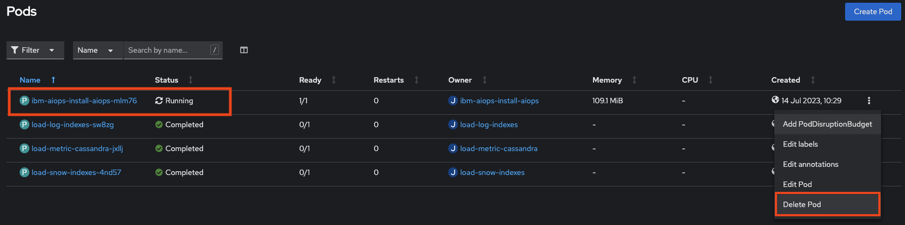

7. Confirm

This will restart the complete installation process. But it will be much faster as it is mainly incremental.

</details>


<div style="page-break-after: always;"></div>

---------------------------------------------------------------
# 5 Annex
---------------------------------------------------------------


---------------------------------------------------------------
## 5.1 Slack integration
---------------------------------------------------------------

### ❗ Those instructions need updating, please follow the official documentation.

For the system to work you need to follow those steps:


1. Create Slack Workspace
1. Create Slack App
1. Create Slack Channels
1. Create Slack Integration
1. Get the Integration URL
1. Create Slack App Communications
1. Slack Reset

<div style="page-break-after: always;"></div>


<details>
<summary>📥 Detailed Instructions</summary>

### 5.1.1 Create your Slack Workspace

1. Create a Slack workspace by going to https://slack.com/get-started#/createnew and logging in with an email <i>**which is not your IBM email**</i>. Your IBM email is part of the IBM Slack enterprise account and you will not be able to create an independent Slack workspace outside if the IBM slack service. 

  

2. After authentication, you will see the following screen:

  

3. Click **Create a Workspace** ->

4. Name your Slack workspace

  

  Give your workspace a unique name such as aiops-\<yourname\>.

5. Describe the workspace current purpose

  

  This is free text, you may simply write “demo for IBM AIOps” or whatever you like.

6. 

  

  You may add team members to your new Slack workspace or skip this step.


At this point you have created your own Slack workspace where you are the administrator and can perform all the necessary steps to integrate with CP4WAOps.


**Note** : This Slack workspace is outside the control of IBM and must be treated as a completely public environment. Do not place any confidential material in this Slack workspace.

<div style="page-break-after: always;"></div>


### 5.1.2 Create Your Slack App

1. Create a Slack app, by going to https://api.slack.com/apps and clicking `Create New App`. 

   


2. Select `From an app manifest`


  

3. Select the appropriate workspace that you have created before and click `Next`

4. Copy and paste the content of this file [./doc/slack/slack-app-manifest.yaml](./doc/slack/slack-app-manifest.yaml).

	Don't bother with the URLs just yet, we will adapt them as needed.

5. Click `Next`

5. Click `Create`

6. Scroll down to Display Information and name your IBMAIOPS app.

7. You can add an icon to the app (there are some sample icons in the ./tools/4_integrations/slack/icons folder.

8. Click save changes

9. In the `Basic Information` menu click on `Install to Workspace` then click `Allow`

<div style="page-break-after: always;"></div>


### 5.1.3 Create Your Slack Channels


1. In Slack add a two new channels:
	* aiops-demo-reactive
	* aiops-demo-proactive

	


2. Right click on each channel and select `Copy Link`

	This should get you something like this https://xxxx.slack.com/archives/C021QOY16BW
	The last part of the URL is the channel ID (i.e. C021QOY16BW)
	Jot them down for both channels
	
3. Under Apps click Browse Apps

	

4. Select the App you just have created

5. Invite the Application to each of the two channels by typing

	```bash
	@<MyAppname>
	```

6. Select `Add to channel`

	You shoud get a message from <MyAppname> saying `was added to #<your-channel> by ...`


<div style="page-break-after: always;"></div>

### 5.1.4 Integrate Your Slack App

In the Slack App: 

1. In the `Basic Information` menu get the `Signing Secret` (not the Client Secret!) and jot it down

	
	
3. In the `OAuth & Permissions` get the `Bot User OAuth Token` (not the User OAuth Token!) and jot it down

	

In the IBM AIOps (IBMAIOPS) 

1. In the `IBM AIOps` "Hamburger" Menu select `Define`/`Integrations`
1. Click `Add connection`

	
	
1. Under `Slack`, click on `Add Connection`
	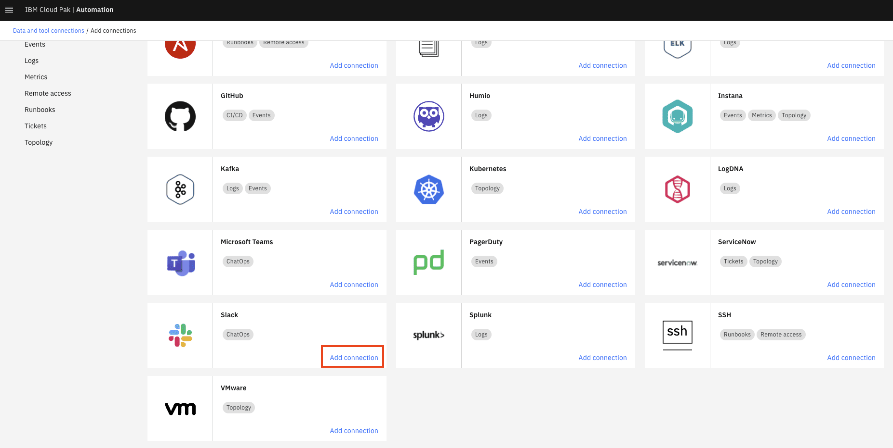

6. Name it "Slack"
7. Paste the `Signing Secret` from above
8. Paste the `Bot User OAuth Token` from above

	
	
9. Paste the channel IDs from the channel creation step in the respective fields

	
	
	
		
		

10. Test the connection and click save


<div style="page-break-after: always;"></div>


### 5.1.5 Create the Integration URL

In the IBM AIOps (IBMAIOPS) 

1. Go to `Define `\`Integrations`
2. Under `Slack` click on `1 integration`
3. Copy out the URL

	

This is the URL you will be using for step 6.


<div style="page-break-after: always;"></div>


### 5.1.6 Create Slack App Communications

Return to the browser tab for the Slack app. 

#### 5.1.6.1 Event Subscriptions

1. Select `Event Subscriptions`.

2. In the `Enable Events` section, click the slider to enable events. 

3. For the Request URL field use the `Request URL` from step 5.

	e.g: `https://<my-url>/aiops/aimanager/instances/xxxxx/api/slack/events`

4. After pasting the value in the field, a *Verified* message should display.

	

	If you get an error please check 5.7

5. Verify that on the `Subscribe to bot events` section you got:

	*  `app_mention` and 
	*  `member_joined_channel` events.

	

6. Click `Save Changes` button.


#### 5.1.6.2 Interactivity & Shortcuts

7. Select `Interactivity & Shortcuts`. 

8. In the Interactivity section, click the slider to enable interactivity. For the `Request URL` field, use use the URL from above.

 **There is no automatic verification for this form**


9. Click `Save Changes` button.

#### 5.1.6.3 Slash Commands

Now, configure the `welcome` slash command. With this command, you can trigger the welcome message again if you closed it. 

1. Select  `Slash Commands`

2. Click `Create New Command` to create a new slash command. 

	Use the following values:
	
	
	| Field | Value |
	| --- | --- |
	|Command| /welcome|
	|Request URL|the URL from above|
	|Short Description| Welcome to IBM AIOps|

3. Click `Save`.

#### 5.1.6.4 Reinstall App

The Slack app must be reinstalled, as several permissions have changed. 

1. Select `Install App` 
2. Click `Reinstall to Workspace`

Once the workspace request is approved, the Slack integration is complete. 

If you run into problems validating the `Event Subscription` in the Slack Application, see 5.2

<div style="page-break-after: always;"></div>

<div style="page-break-after: always;"></div>


<div style="page-break-after: always;"></div>

### 5.1.7 Slack Reset


#### 5.1.7.1 Get the User OAUTH Token

This is needed for the reset scripts in order to empty/reset the Slack channels.

This is based on [Slack Cleaner2](https://github.com/sgratzl/slack_cleaner2).
You might have to install this:

```bash
pip3 install slack-cleaner2
```
##### Reset reactive channel 

In your Slack app

1. In the `OAuth & Permissions` get the `User OAuth Token` (not the Bot User OAuth Token this time!) and jot it down

In file `./tools/98_maintenance/scripts/13_reset-slack.sh`

2. Replace `not_configured` for the `SLACK_TOKEN` parameter with the token 
3. Adapt the channel name for the `SLACK_REACTIVE` parameter


##### Reset proactive channel 

In your Slack app

1. In the `OAuth & Permissions` get the `User OAuth Token` (not the Bot User OAuth Token this time!) and jot it down (same token as above)

In file `./tools/98_maintenance/scripts/14_reset-slack-changerisk.sh`

2. Replace `not_configured` for the `SLACK_TOKEN` parameter with the token 
3. Adapt the channel name for the `SLACK_PROACTIVE` parameter


#### 5.1.7.2 Perform Slack Reset

Call either of the scripts above to reset the channel:

```bash

./tools/98_maintenance/scripts/13_reset-slack.sh

or

./tools/98_maintenance/scripts/14_reset-slack-changerisk.sh

```
</details>

