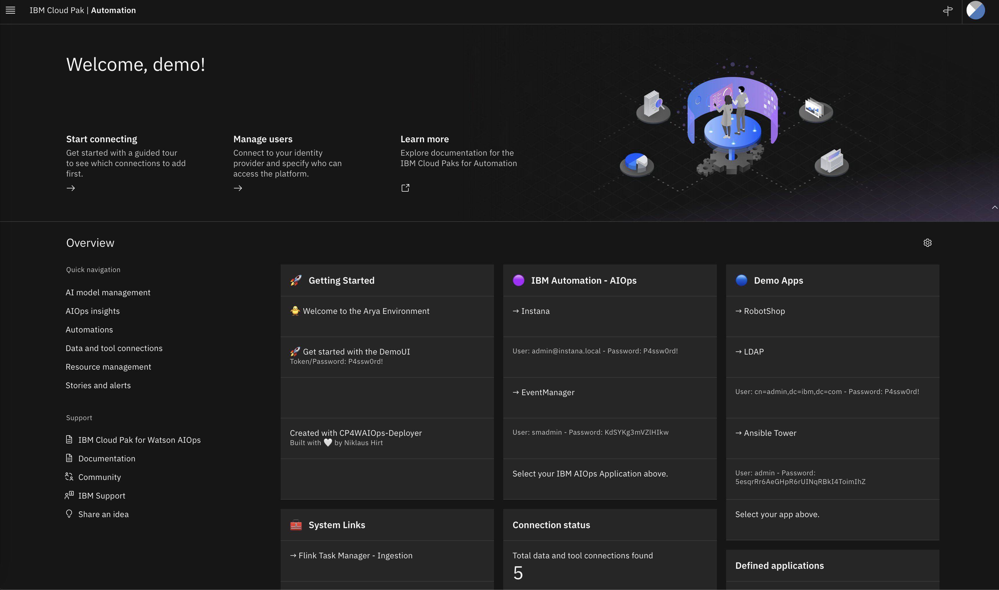
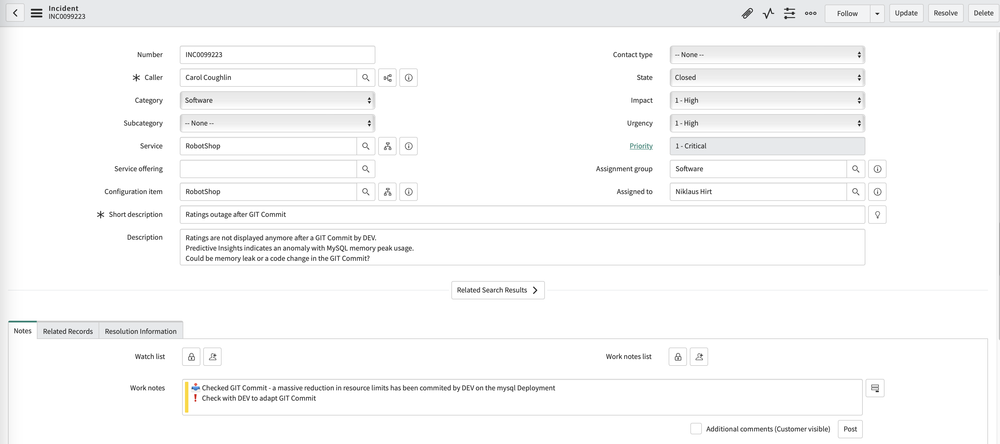
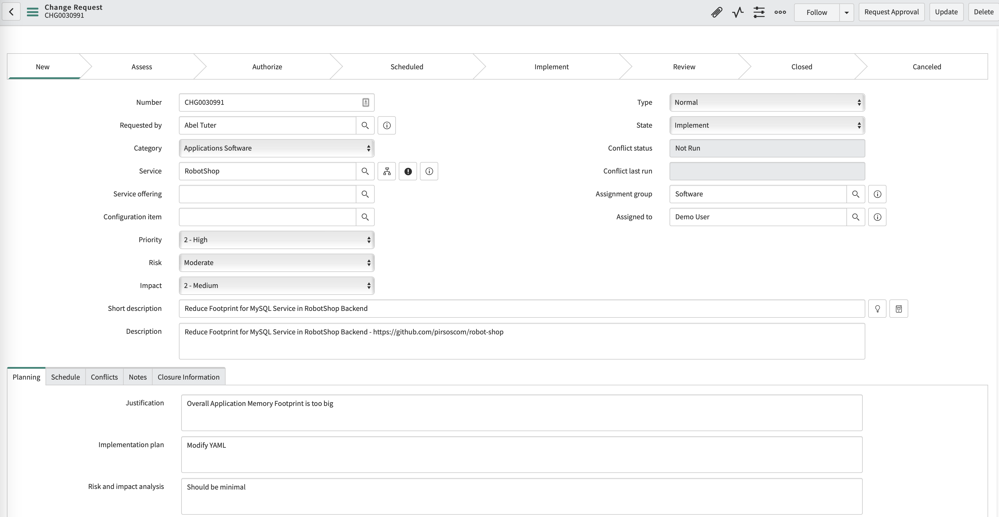
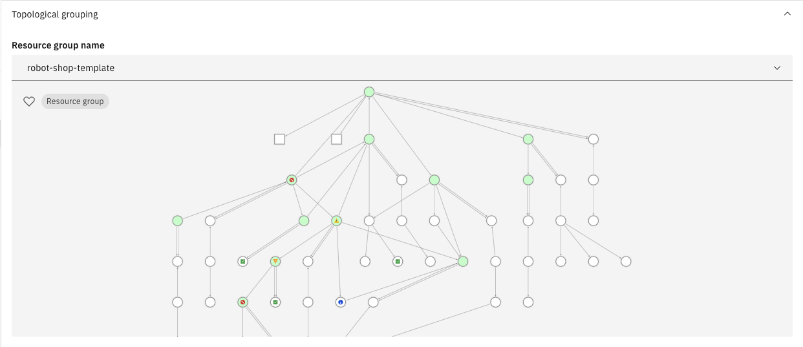
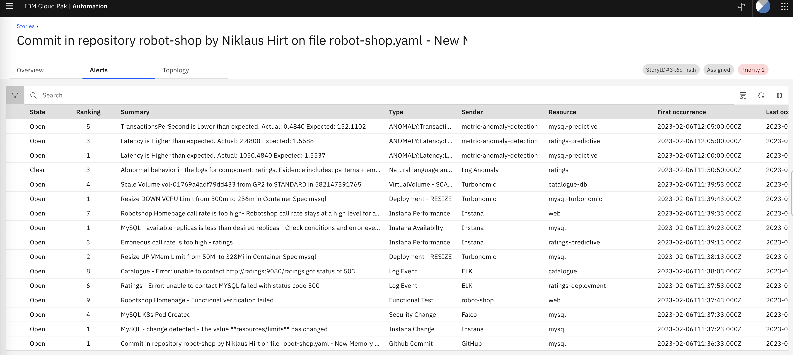
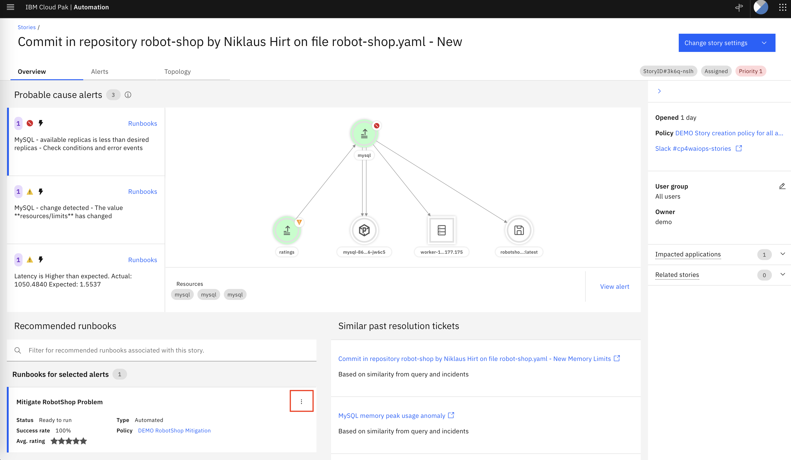

 <h1>IBM AIOps </h1> 

 <h2>Sample Demo Script for the live demo environment</h2> 

 ©2023 Włodzimierz Dymaczewski/Niklaus Hirt / IBM 

- 

## 1.2 Get access to a live demo environment

To get a demo environment you have two possibilities:

### 1.2.1 Reserved preconfigured Instances

To reserve a preconfigured demo environment, follow [this link](https://techzone.ibm.com/collection/ibmaiopsdemo#tab-1) to TechZone to create a reservation and to request access credentials. 

**❗Due to the nature of the product, IBM AIOps demo environments can be used effectively by a single user at a time. Because of that, provided environments are intended for enablement and practicing rather than for actual client demo!**

**⚠️ Please don't create your own applications in the shared demo environments or modify it in any shape or form. If you need to customize the demo install your own instance.**

### 1.2.2 Install your own environment

You can easily provision your own instance of the demo environment, as described in [Provisioning you own instance of IBMAIOps demo](https://github.com/niklaushirt/ibmaiops-deployer#-1-quick-install).

This takes about 15 minutes of your time and 2-3 hours for the installation to complete in the background.

# 2. 🚀 Get started

## 2.1 Connect to the Demo UI

1. Click on your reservation 

	

1. Click on `Open environment details` 

	
	
	

1. Click on `Open your demo environment`

	

## 2.2 Navigating The Demo UI

The Demo UI should open:

The most important functionalities are:

1. **Open IBMAIOps (login with the provided credentials)**
2. **Clear all existing Stories and Alerts**
3. **Create an Incident**

> ℹ️ If you are asked to login to the Demo UI, please use the toekn/password `P4ssw0rd!`

> ⚠️ Before start, you should open the IBMAIOps and check that there are no open stories and alerts pending. If there are some created few hours before (leftovers from somebody else not completing the demo) you can clean them up using IBMAIOps Demo UI as shown below.

## 2.3 Demonstration scenario

### 2.3.1 Overview

This use case shows clients how IBM IBM AIOps proactively helps avoid application downtimes and incidents impacting end-users. You play the role of an SRE/Operations person who has received a Slack message indicating that the RobotShop application is not displaying customer ratings. This is an important feature of the RobotShop application since RobotShop is the main platform from which the fictional company sells its robots.

### 2.3.2 Use Case

The use case demonstrates how IBM AIOps can assist the SRE/Operations team as they identify, verify, and ultimately correct the issue. The demonstration shows integration with Instana, Turbonomic, ServiceNow, and Slack. Slack is the ChatOps environment used for working on this incident. 

You will demonstrate the following major selling points around IBM AIOps:

1. **Pulls data from various IT platforms**: IBM IBM AIOps monitors incoming data feeds including logs, metrics, alerts, topologies, and tickets, highlighting potential problems across incoming data, based on trained machine learning models.
1. **Utilizes AI and natural language processing**: An insight layer connects the dots between structured and unstructured data, using AI and natural language processing technologies. This allows you to quickly understand the nature of the incident.
1. **Provides trust and transparency**: Using accurate and trustworthy recommendations, you can move forward with the diagnosis of IT system problems and the identification and prioritization of the best resolution path.
1. **Resolves rapidly**: Time and money are saved from out-of-the-box productivity that enables automation and utilizes pre-trained models. A “similar issue feature” from past incidents allows you to get services back online for customers and end-users.

## 2.4 Demonstration flow
1. Scenario introduction
1. Trigger problem situation [In the background] 
1. Verify the status of the Robot Shop application.
1. Understanding and resolving the incident
   1. Login to IBMAIOps
   1. Open the Incident
   1. Examining the Incident
   1. Acknowledge the Incident
   1. Similar Incidents
   1. Examine the Alerts
   1. Understand the Incident
   1. Examining the Topology
   1. [Optional] Topology in-depth
   1. Fixing the problem with runbook automation
   1. Resolve the Incident
1. Summary

# 3. Deliver the demo

## 3.1 Introduce the demo context

**📣 <u>Narration</u>** 

Welcome to this demonstration of the IBM AIOps platform. In this demo, I am going to show you how IBM AIOps can help your operations team proactively identify, diagnose, and resolve incidents across mission-critical workloads.

You’ll see how:

- IBM AIOps intelligently correlates multiple disparate sources of information such as logs, metrics, events, tickets and topology
- All of this information is condensed and presented in actionable alerts instead of large quantities of unrelated alerts
- You can resolve a problem within seconds to minutes of being notified using IBM AIOps’ automation capabilities

During the demonstration, we will be using the sample application called RobotShop, which serves as a proxy for any type of app. The application is built on a microservices architecture, and the services are running on Kubernetes cluster.

>**🚀 <u>Action</u>**
>Use demo [introductory PowerPoint presentation](https://github.com/niklaushirt/ibmaiops-deployer/blob/main/doc/CP4AIOPS_DEMO_2023_V1.pptx?raw=true), to illustrate the narration. Adapt your details on Slide 1 and 13

**📣 <u>Narration</u>**

**Slide 2**: Let’ look at the environment that we have set up. Our sample application: “RobotShop” is running as a set of microservices in a Kubernetes cluster. Typically, the Operations team maintaining such application has a collection of tools through which they collect various data types. 

**Slide 3**: Here we have several systems that are sending Events into AIOPS (slide 3), like:

- GitHub
- Turbonomic
- Instana
- Selenium
- Falcon (Sysdig)

Those Events are being grouped into Alerts to massively reduce the number of signals that have to be treated. We usually observe a ratio of about 98-99% of reduction. This means that out of 20'000 events we get about 200-300 Alerts that can be further prioritised.

**Slide 4**: AIOPS also ingests Logs from ElasticSearch (this could be Splunk or other Log Aggregators). The Log Anomaly detection is trained on a well running system and is able to detect anomalies and outliers. If an Anomaly is detected it will be grouped with the other Events.

**Slide 5**: AIOPS also ingests Metrics from Instana (this could be Dynatrace, NewRelic or others). The Metric Anomaly detection is trained on a well running system and creates dynamic baselines. Through different algorithms it is able to detect anomalies and outliers. If an Anomaly is detected it will also be grouped with the other Events.

**Slide 6**: Alerts that are relevant for the same Incident are packaged into a so called Incident. The Incident will be enriched and updated with information as it gets available.

 **Slide 7**: One example is the Topology information. Not only will AIOPS tell me that I have a problem and present all relevant Events but it will also tell me where in the system topology the problem is situated. 

**Slide 8**: Furthermore the Incident is enriched with past resolution information coming from ServiceNow tickets. I'll explain this more in detail during the demo.

**Slide 9**: The Stories can either be examined in the AIOPS web interface or can be pushed to Slack or Teams if your teams are using a ChatOps approach.

**Slide 10**: If Operations or SREs have created Runbooks, AIOPS can automatically trigger a Runbook to mitigate the problem.

**ℹ️ <u>Note</u>**: We are NOT using Slack in this demo.

**📣 <u>Narration</u>**

Now let's start the demo.

## 3.2 Trigger the incident

**❗ <u>Note</u>**: The following step does not have to be shown to the client – you may perform the action in the background if possible.

>**🚀 <u>Action</u>**
>Open IBMAIOps **Demo** UI, and trigger the incident
>
>- Point your browser to the IBMAIOps Demo UI, 
>
>- Login with the token “P4ssw0rd!” and 
>
>- Trigger the incident `(3)` you would like to use in your demo. 
>
>  
>
>  This action injects the stream of simulated events into the system, which replicates what could happen in a real life situation.

## 3.3 Verify the status of the Robot Shop application

### 3.3.1 Show the Application

>**🚀 <u>Action</u>**
>Open the RobotShop application
>
>The Link can be found in the **Demo UI** under **Third-Party**. Play with the application UI.

**📣 <u>Narration</u>**

In this demo I am the application SRE (Site Reliability Engineer) responsible for an e-commerce website called RobotShop, an online store operated by my company. In the middle of the day (when clients make most of the purchases) I received a slack message on my mobile, alerting me that there is some problem with the site.

Let’s verify what’s going on with the RobotShop site. The application is up but displays an error that it cannot get any ratings.

### 3.3.2 Show ratings not working

>**🚀 <u>Action</u>**
Open any robot details to show that there are no ratings displayed.

**📣 <u>Narration</u>**

I know that there are many ratings for each of the products that we sell, so when none are displayed, it means that there is a likely problem with `Ratings` service withing application that may heavily impact client’s purchasing decisions, as well as may be a sign of a wider outage.

## 3.4 Understanding and resolving the incident

### 3.4.1 Login to IBMAIOps

>**🚀 <u>Action</u>**
In the Demo UI, click **IBMAIOps `(1)`**

**📣 <u>Narration</u>**

Let’s take a closer look at the incident that has been created in IBM AIOps.

### 3.4.2 Open the Incident

  

>**🚀 <u>Action</u>**
Click the "hamburger menu" on the upper left. Click **Stories and alerts**

**📣 <u>Narration</u>**

We can see that the simulation has created a **Incident**. The **Incident** includes grouped information related to the incident at hand. It equates to a classic War Room that are usually put in place in case of an outage. 
The **Incident** contains related log anomalies, topology, similar incidents, recommended actions based on past trouble tickets, relevant events, runbooks, and more.

### 3.4.3 Examining the Incident

  

>**🚀 <u>Action</u>**
Click the "hamburger menu" on the upper left. Click **Stories and alerts** 

**📣 <u>Narration</u>**

Now let's have a look at the **Incident**.

As I said before, the Incident regroups all relevant information concerning the incident at hand that have been identified by IBM AIOps.

1. A list of Alerts that have been identified by IBM AIOps to be the most probable cause
2. The localization of the problem related to the Topology
3. The suggested Runbooks to automatically mitigate the incident
4. Similar Incidents that resemble the incident at hand
5. Status of the Incident - here I can change the status and priority of the incident

### 3.4.4 Acknowledge the Incident

>**🚀 <u>Action</u>**
>Click on **Change Incident Settings.**
>
>Select **Change Status.**
>
>Click on  **In progress**

  

**📣 <u>Narration</u>**

First and before I continue examining the Incident I want to let my colleagues know that I'm working on the incident. So let me set it to In Progress.

### 3.4.5 Similar Incidents

>**🚀 <u>Action</u>**
Click the first similar resolution ticket  

  

**📣 <u>Narration</u>**

Most large organizations use IT Service Management tools to govern processes around IT. Our organization is using ServiceNow for that purpose. Past incidents with resolution information are ingested and analysed by IBM AIOps.

The IBM IBM AIOps trains on exisitng tickets and it extracts the steps used to fix previous incidents (if documented) and recommend resolutions using natural language processing. This AI model helps you discover historical incidents to aid in the remediation of current problems. 

So for the **Incident**, your team is presented with the top-ranked similar incidents from the past. These relevant similar incidents help speed up incident resolution even if the I don't have access to ServiceNow. Without these features, your team must manually search for past incidents and resolutions, which is time-consuming.

In this particular example I can see that the problem was related to a GIT Commit that massivly reduced the resource limits has been commited by DEV on the mysql Deployment.

Let me check how the problem was resolved for this incident.

**❗ <u>Note</u>**:  In the Robot Shop demo scenario, the integration with ServiceNow is simulated with the static content. 

#### Resolution Information

>**🚀 <u>Action</u>**
>Click on the **Resolution Information** Tab

  

**📣 <u>Narration</u>**

It seems that it was resolved by changing the mysql deployment and a Runbook had been created to mitigate the problem.

To finish up, I will check if the incident was related to an official change.

#### Examine the Change

>**🚀 <u>Action</u>**
>Click on the **Related Records** Tab
>
>Click on the **i** Button next to **Caused by Change**

  

**📣 <u>Narration</u>**

Ok, so now I can see that the problem is related to a Change that aims to reduce the footprint of the mysql database.

As it's still ongoing, chances are high, that the development team recreated a similar problem.

Obviously, in real life I would now start the Runbook to see if it resolves the problem.
But for the sake of the demo, let's dig a little deeper first.

### 3.4.6 Examine the Alerts

>**🚀 <u>Action</u>**
Close the ServiceNow page and click the **Alerts** Tab. 

  

**📣 <u>Narration</u>**

Notice, that alerts are not sorted by severity, but the AI engine ranked them by relevance. The ones that are likely related to the root cause are at the top. Let’s look at the first row for some more details. 

>**🚀 <u>Action</u>**
Click on the first Alert in the list. 

**📣 <u>Narration</u>**

In the **Alert details,** you can see different types of groupings explaining why the specific alert was added to the incident.

#### Scope based grouping

>**🚀 <u>Action</u>**
Click **Scope-based grouping**. 

**📣 <u>Narration</u>**

Some alerts were added to the incident because they occurred on the same resource within a short period (default is 15 minutes)

#### Topological grouping

>**🚀 <u>Action</u>**
Click **Topological grouping**. 

**📣 <u>Narration</u>**

Other alerts were grouped because they occurred on the logically or physically related resources. This correlation is using the application topology service that stitches topology information from different sources.

#### Temporal grouping

>**🚀 <u>Action</u>**
Click **Temporal correlation**. 

**📣 <u>Narration</u>**

Finally, the temporal correlation adds to the incident events that previously, in history, are known to occur close to each other in the short time window. What is most important here is the fact that all these correlations happen automatically – there is no need to define any rules or program anything. In highly dynamic and distributed cloud-native applications this is a huge advantage that saves a lot of time and effort.

>**🚀 <u>Action</u>**
**Close** the Alert details window. 

### 3.4.7 Understand the Incident

>**🚀 <u>Action</u>**
>Click twice on the  **Last occurence** Header. 
>
>***Result**: The "Commit in repository robot-shop by Niklaus Hirt on file robot-shop.yaml" should be at the bottom* 

  

**📣 <u>Narration</u>**

When trying to understand what happened during the incident, I sort the Alerts by occurence. This allows you to understand the chain of events.

* I can see that the first event was a code change that had been commited to **GitHub**. When I hover over the description I get the full text.
So it seems that the Development Team has reduced the available memory for the mysql database.

Other events are confirming the hypothesis. 
* I can then see the CI/CD process kick in and deploys the code change to the system detected by the Security tool and 
* **Instana** has has detected the memory size change. 

* Then **Functional Selenium Tests** start failing and 
* **Turbonomic** tries to scale-up the mysql database.
* **Instana** tells me that the mysql Pod is not running anymore, the replicas are not matching the desired state.

* IBM AIOps has learned the normal, good patterns for logs coming from the applications. The Incident contains a **Log Anomaly** that has been detected in the ratings service that cannot acces the mysql database.

>**🚀 <u>Action</u>**
Click on a Alert line that has **ANOMALY:** in the Type column. Then open the **Metric Anomaly Details** accordion. 

**📣 <u>Narration</u>**

* IBM AIOps is also capable of collecting metrics from multiple sources and detecting **Metric Anomalies**. It was trained on hundreds or thousands of metrics from the environment and constructs a dynamic baseline (shown in green). The graphic suddenly turns red which relates to detected anomaly when the database is consuming a higher amount of memory than usual.

>**🚀 <u>Action</u>**
(1) In **Related Alerts** select some additional alerts.

**📣 <u>Narration</u>**

You can display several alerts at the same time to better understand the temporal dependencies

>**🚀 <u>Action</u>**
(2) Select a portion of the graph with your mouse to zoom in

**📣 <u>Narration</u>**

Now let's zoom in to better see the anomalies

>**🚀 <u>Action</u>**
Hover over a datapoint to show the before/after values. 

**📣 <u>Narration</u>**

I can clearly see that the incident caused the **Latencies** to skyrocket and the **Transactions per Seconds** are almost zero. This is yet another confirmation of the source of the problem.

>**🚀 <u>Action</u>**
Close the Metric anomaly details view. 

### 3.4.8 Examining the Topology

>**🚀 <u>Action</u>**
>Click the **Topology** Tab. 
>
>***Result**: The topology is displayed.* 

**📣 <u>Narration</u>**

The interface shows the **topology** of the application that is relevant to the incident. IBM IBM AIOps’ topology service delivers a working understanding of the resources that you have in your environment, how the resources relate to each other, and how the environment has changed over time.

You can see that there are some statuses attached to the different resources, marked with colorful dots. Let’s view the details and status of the **mysql** resource with red status. 

  

>**🚀 <u>Action</u>**
>Find the resource which displays resource name “**mysql**”. Then, right-click and select **Resource details.** 
>
>***Result**: Detailed view displays.*

>**🚀 <u>Action</u>**
>Click on Tab **Alerts** 
>
>***Result**: Detailed view of the Alerts specific for this resource.*

**📣 <u>Narration</u>** 

The topology service provides operations teams with complete up-to-date visibility over dynamic infrastructure, resources, and services. The topology service lets you query a specific resource for details, and other relevant information. Here I can see all Alerts for the mysql database resource for example.

### 3.4.9 [Optional] Topology in-depth

>**🚀 <u>Action</u>**
>Find the resource which displays resource name “mysql”. Then, right-click and select **Open in Topology Viewer.** 
>
>***Result**: Topology Viewer displays.*

**📣 <u>Narration</u>**

The interface shows the topology surrounding the mysql resource. I can see that the **mysql** deployment is being called by the **ratings** service and that it runs on a certain worker node. 

>**🚀 <u>Action</u>**
>Change the number of hops to `4` and click **Render**.** 
>
>***Result**: Topology Viewer refreshes with bigger topology.*

**📣 <u>Narration</u>**

 I can also increase the size of the graph, still based on the **mysql** deployment.

>**🚀 <u>Action</u>**
>Right-click om mysql and select **Show last change in timeline** and check **Delta**
>
>***Result**: Topology Viewer refreshes and shows the events over time.*

**📣 <u>Narration</u>**

 Now I will examine the historical events for the **mysql** component. I can see the **Alerts** that have been raised on the **mysql** resource over time.

### 3.4.10 Fixing the problem with runbook automation
>**🚀 <u>Action</u>**
>
>Click on the  **Overview**  Tab.

**📣 <u>Narration</u>**

Now that we know what the problem is, let’s correct what has happened. A runbook has been automatically identified but have not been executed. Runbooks are guided steps that IT operations teams use to troubleshoot and resolve problems. Some organizations might call these standard operating procedures or playbooks. When an incident occurs, IBM IBM AIOps matches an appropriate runbook to the problem. The runbook can be set to run automatically when it is matched to an incident, or it can run with user approval and participation. 

Let’s execute the Runbook.

>**🚀 <u>Action</u>**
>
>Click on the three dots and click **Run**
>
>Click **Start Runbook**.

>**🚀 <u>Action</u>**
>
>Click **Run** in Step 1.

**❗ <u>Note</u>**: The execution of the runbook can take few minutes. 

**📣 <u>Narration</u>**

The Runbook that I just started kicks off a Playbook on Ansible Tower. I can follow the execution as it connects to the cluster and then scales up memory for the MySQL deployment.

>**🚀 <u>Action</u>**
>
>When finished, click **Complete**.
>
>Open the RobotShop application. Verify that ratings are correctly shown 

**📣 <u>Narration</u>**

Before confirming that the runbook worked as expected, I should check the RobotShop application to see if it is working as expected.

>**🚀 <u>Action</u>**
>
>Rate the Runbook
>
>Then click **Runbook Worked**.

**📣 <u>Narration</u>**

So the runbook has resolved the problem. When I tell IBM AIOps that the Runbook worked, it will learn over time to prioritize and suggest more relevant Runbooks.

### 3.4.11 Resolve the Incident

>**🚀 <u>Action</u>**
>Click on **Change Incident Settings.**
>
>Select **Change Status.**
>
>Click on  **Resolved**

  

**📣 <u>Narration</u>**

So now as we have resolved the problem,  I will inform the development team of the problem by reopening the ServiceNow ticket and by closing the Incident. 

# Demonstration summary
Today, I have shown you how IBM AIOps can assist the SRE/Operations team to identify, verify, and ultimately correct an issue with a modern, distributed application running in a cloud-native environment. The presented solution provides automatic application topology discovery, anomaly detection both with metrics and logs, and sophisticated methods of correlation of events coming from different sources. 

