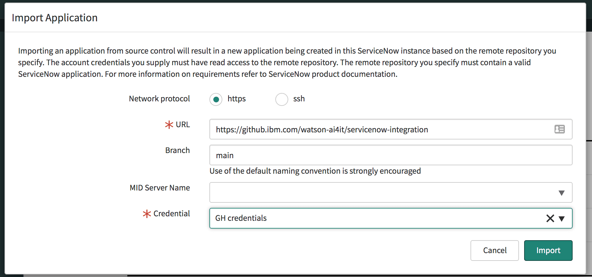

# ServiceNow integration App

## 1. How to import app into ServiceNow instance

Pre-req: Personal access token for Github. If you don't have one, follow the instructions https://docs.github.com/en/free-pro-team@latest/github/authenticating-to-github/creating-a-personal-access-token to create one (no elevated permissions needed for the token).

1. Obtain a developer instance for ServiceNow following the instructions from https://developer.servicenow.com/dev.do#!/guides/paris/now-platform/pdi-guide/obtaining-a-pdi (this requires a ServiceNow account which can be created as part of the steps - just sign up for a new account). Note: development instances go into hibernation when not used and are decommissined if not used for 10 days.
1. Log on to the development instance.
1. Search for `Credentials`.

1. Select `Credentials` under `Connections & Credentials`.

1. Select `Basic Authentication`.

1. Enter any name, provide your login email address for Github and as password provide your personal access token. Then click `Submit`.

1. In the Search field, type in `Studio`. Select `Studio` under `System Applications`. This will open the Application Studio in a new tab.

1. In the `Select Application` dialog, click `Import from Source Control`.

1. Fork the following repository `https://github.ibm.com/jorgego/servicenow-integration-fork`
1. Enter `https://github.ibm.com/<your-repo>/servicenow-integration-fork` as repository, `main` as the branch and in the `Credential` drop-down, select the entry with the credentials that were created in the previous steps.

1. Click `Import` to import the source code.

