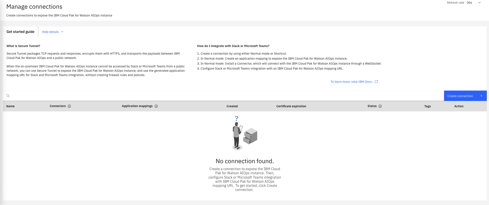
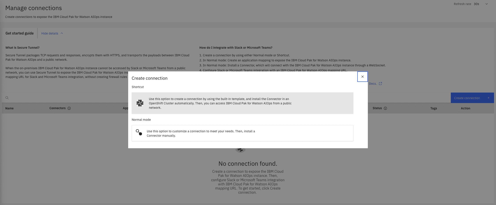
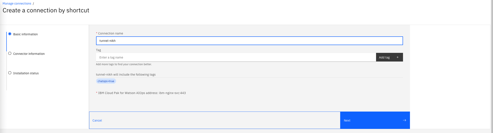
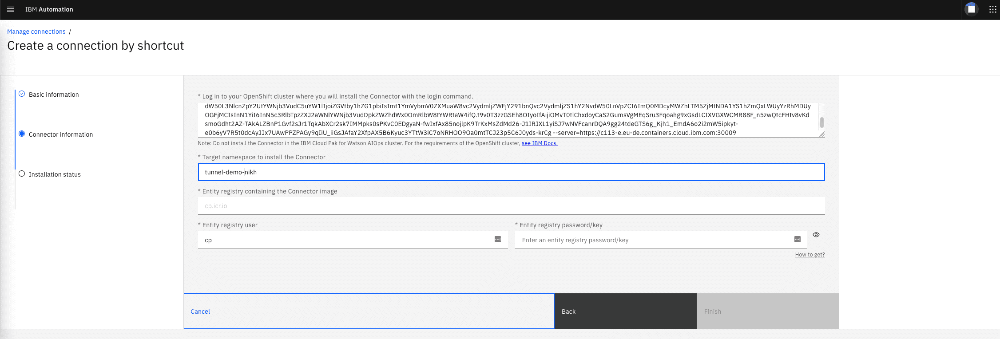
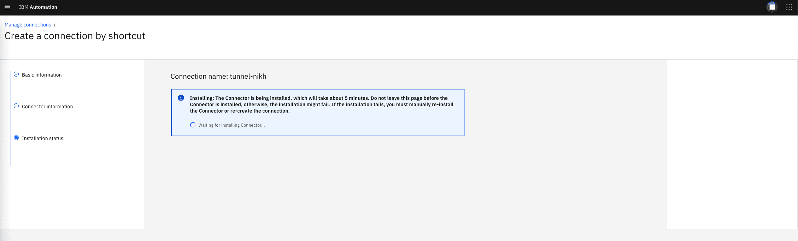

# Get the Integration URL for Private Cloud (Fyre, TEE, ...) - IBMAIOPS Tunnel


As the Slack integration requires a two-way communication and for Slack to communicate with the AIOps server, you need to configure a tunnel, a feature that is included in IBMAIOPS.  

> ❗To use this feature, make sure the Secure Tunnel is enabled in the installtion definition.
> 
> 
```yaml
apiVersion: orchestrator.aiops.ibm.com/v1alpha1
kind: Installation
metadata:
  name: {{ AIOPS_NAME }}
  namespace: {{ AIOPS_NAMESPACE }}
spec:
  imagePullSecret: ibm-entitlement-key
  license:
    accept: true
  pakModules:
    - enabled: true
      name: aiManager
    - enabled: true
      name: aiopsFoundation
    - enabled: true
      name: applicationManager
    - enabled: true    <-- Make sure this is set to true ⚠️
      name: connection
```

> The automated install does this by default.


1. Open your IBMAIOps Web UI

1. In the `IBMAIOps` "Hamburger" Menu select `Administration`/`Tunnel`

   

1. Click `Create Connection`

1. Click on the `Shortcut` Option

	

1. Enter any name that helps you identify the tunnel

	

1. Enter the connection information for the Bastion/Tunnel Cluster:

	- Enter the login command you can find at the very end of the `LOGIN_TEC.txt` file
	- Enter a unique Namespace name to install tunnel (try to postfix it with your name)
	- Enter your registry password/pull-token from [https://myibm.ibm.com/products-services/containerlibrary](https://myibm.ibm.com/products-services/containerlibrary). This allows the IBMAIOPS tunnel images to be pulled from the IBM Container Registry. 

	

1. Click `Finish`

1. IBMAIOPS will install the tunnel. This will take some time (up to 5 minutes)

	

1. Copy the first URL and jot it down

	


This means that you're good to go.

This is the URL you will be using for step 6.


