
 <h1>IBM AIOps </h1> 

 <h2>Sample Demo Script for the Click Through PPT</h2> 

 ©2025 Włodzimierz Dymaczewski/Niklaus Hirt / IBM 

# 1. Introduction

This script is intended as a guide to demonstrate IBM AIOps using the Click Through PPT. The script is presented in a few sections. You can utilize some or all sections depending upon your client’s needs. 

The script is intended to be used with the [Click Through PPT](https://ibm.box.com/s/icgkxzlt2ja6dth16dpdin055uyysej1).

You can watch the [Demo Walkthrough video](https://ibm.box.com/s/icgkxzlt2ja6dth16dpdin055uyysej1l) to get an idea on how to do the demo (based on 3.2). 

In the demo script, 

- “**🚀 <u>Action</u>**” denotes a setup step for the presenter.
- “**📣 <u>Narration</u>**” denotes what the presenter will say. 
- “**ℹ️ <u>Note</u>**” denotes where the presenter may need to deviate from this demo script or add supplemental comments.

## 1.1 Key Terminology
You should be familiar with the following terminology when discussing IBM AIOps:

- **Application**: IBM IBM AIOps brings together the capability to group resources from different data types into applications. Clients can flexibly define an application to meet their business needs. With applications, you can obtain an integrated view of resources to understand inter-dependencies.
- **Event**: A point-in-time statement in IBM AIOps that tells us that something happened somewhere in a client’s environment. It tells us what happened, where it happened, and when it happened.  An event does not have to be exceptional or actionable, it can simply tell us something has happened.  
- **Alert**: An alert in IBM AIOps represents an abnormal condition somewhere in an environment that requires resolution. It tells us what is happening, where it is happening, and when it started to happen.  It may be informed by one or more events. It has a start time and end time. 
- **Incident**: A incident in IBM AIOps represents an outage or reduction in service which is currently impacting customers and requires rapid remediation.  It is created based on one or more trigger alerts that indicate the outage or reduction in service.  Any alert of severity Major or Critical will act as a trigger alert. Other alerts that share the same cause may add context to the incident. 
- **Incident**: An incident in ServiceNow is an event of interruption disruption or degradation in normal service operation. An open incident in ServiceNow implies that the customer is impacted, or it represents the business risk.
- **Topology**: A topology is a representation of how constituent parts are interrelated. In IBM AIOps, an algorithm analyzes how the event nodes are proximate to each other and groups them into a topology-based correlation.

## 1.2 Demonstration scenario

### 1.2.1 Overview

This use case shows clients how IBM IBM AIOps proactively helps avoid application downtimes and incidents impacting end-users. You play the role of an SRE/Operations person who has received a Slack message indicating that the RobotShop application is not displaying customer ratings. This is an important feature of the RobotShop application since RobotShop is the main platform from which the fictional company sells its robots.

### 1.2.2 Use Case

The use case demonstrates how IBM AIOps can assist the SRE/Operations team as they identify, verify, and ultimately correct the issue. The demonstration shows integration with Instana, Turbonomic, ServiceNow, and Slack. Slack is the ChatOps environment used for working on this incident. 

You will demonstrate the following major selling points around IBM AIOps:

1. **Pulls data from various IT platforms**: IBM IBM AIOps monitors incoming data feeds including logs, metrics, alerts, topologies, and tickets, highlighting potential problems across incoming data, based on trained machine learning models.
1. **Utilizes AI and natural language processing**: An insight layer connects the dots between structured and unstructured data, using AI and natural language processing technologies. This allows you to quickly understand the nature of the incident.
1. **Provides trust and transparency**: Using accurate and trustworthy recommendations, you can move forward with the diagnosis of IT system problems and the identification and prioritization of the best resolution path.
1. **Resolves rapidly**: Time and money are saved from out-of-the-box productivity that enables automation and utilizes pre-trained models. A “similar issue feature” from past incidents allows you to get services back online for customers and end-users.

## 1.3 Demonstration flow
1. Scenario introduction
1. The Slack Incident
1. Verify the status of the Robot Shop application.
1. Understanding and resolving the incident
   1. Open the Incident
   1. Examining the Incident
   1. Acknowledge the Incident
   1. Probable Cause
   1. Similar Incidents
   1. Metric Anomalies
   1. Examine the Alerts
   1. Understand the Incident
   1. Examining the Topology
   1. Fixing the problem with runbook automation
   1. Resolve the Incident
1. Summary

## 1.4 Demonstration Video Walkthrough

You can watch the [Demo Walkthrough video](https://ibm.box.com/s/icgkxzlt2ja6dth16dpdin055uyysej1l) to get an idea on how to do the demo (based on 3.2). 

# 2. Deliver the demo

## 2.1 Introduce the demo context

**📣 <u>Narration</u>** 

Welcome to this demonstration of the IBM AIOps platform. In this demo, I am going to show you how IBM AIOps can help your operations team proactively identify, diagnose, and resolve incidents across mission-critical workloads.

You’ll see how:

- IBM AIOps intelligently correlates multiple disparate sources of information such as logs, metrics, events, tickets and topology
- All of this information is condensed and presented in actionable alerts instead of large quantities of unrelated alerts
- You can resolve a problem within seconds to minutes of being notified using IBM AIOps’ automation capabilities

During the demonstration, we will be using the sample application called RobotShop, which serves as a proxy for any type of app. The application is built on a microservices architecture, and the services are running on Kubernetes cluster.

>**🚀 <u>Action</u>**
>
>Use demo [introductory PowerPoint presentation](https://github.com/niklaushirt/ibm-aiops-deployer/blob/main/doc/CP4AIOPS_DEMO_2023_V1.pptx?raw=true), to illustrate the narration. Adapt your details on Slide 1 and 13

**📣 <u>Narration</u>**

**Slide 2**: Let’ look at the environment that we have set up. Our sample application: “RobotShop” is running as a set of microservices in a Kubernetes cluster. Typically, the Operations team maintaining such application has a collection of tools through which they collect various data types. 

**Slide 3**: Here we have several systems that are sending Events into AIOPS (slide 3), like:

- GitHub
- Turbonomic
- Instana
- Selenium
- Falcon (Sysdig)

Those Events are being grouped into Alerts to massively reduce the number of signals that have to be treated. We usually observe a ratio of about 98-99% of reduction. This means that out of 20'000 events we get about 200-300 Alerts that can be further prioritised.

**Slide 4**: AIOPS also ingests Logs from ElasticSearch (this could be Splunk or other Log Aggregators). The Log Anomaly detection is trained on a well running system and is able to detect anomalies and outliers. If an Anomaly is detected it will be grouped with the other Events.

**Slide 5**: AIOPS also ingests Metrics from Instana (this could be Dynatrace, NewRelic or others). The Metric Anomaly detection is trained on a well running system and creates dynamic baselines. Through different algorithms it is able to detect anomalies and outliers. If an Anomaly is detected it will also be grouped with the other Events.

**Slide 6**: Alerts that are relevant for the same Incident are packaged into a so called Incident. The Incident will be enriched and updated with information as it gets available.

 **Slide 7**: One example is the Topology information. Not only will AIOPS tell me that I have a problem and present all relevant Events but it will also tell me where in the system topology the problem is situated. 

**Slide 8**: Furthermore the Incident is enriched with past resolution information coming from ServiceNow tickets. I'll explain this more in detail during the demo.

**Slide 9**: The Stories can either be examined in the AIOPS web interface or can be pushed to Slack or Teams if your teams are using a ChatOps approach.

**Slide 10**: If Operations or SREs have created Runbooks, AIOPS can automatically trigger a Runbook to mitigate the problem.

**ℹ️ <u>Note</u>**: We are NOT using Slack in this demo.

## 2.2 The Slack incident

**📣 <u>Narration</u>**

Now let's start the demo.

>**🚀 <u>Action</u>**
>
>- Click on the "Nightmare before Christmas" Tile

**📣 <u>Narration</u>**

In this demo I am the application SRE (Site Reliability Engineer) responsible for an e-commerce website called RobotShop, an online store operated by my company. 

Imagine, it's a morning at the office, some days before Christmas and I'm just getting myself a coffe, when I receive the following slack message on my mobile, alerting me that there is some problem with the site.

Let me check what's happening.

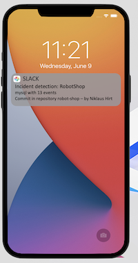

>**🚀 <u>Action</u>**
>
>- Click on the Slack Message

**📣 <u>Narration</u>**

The Slack message has been sent from our IBM AIOps Solution, alerting me, that there is a problem with the RobotShop application, which is our online sales portal. 

Obviously I have to make sure that the pre Christmas sales are running smoothly as this is by far the biggest quarter of the year.

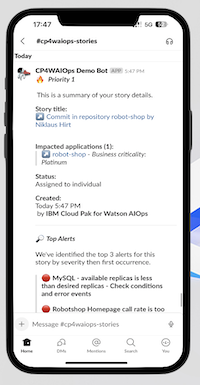

## 2.3 Verify the status of the Robot Shop application

**📣 <u>Narration</u>**
Let me verify what’s going on with the RobotShop site.

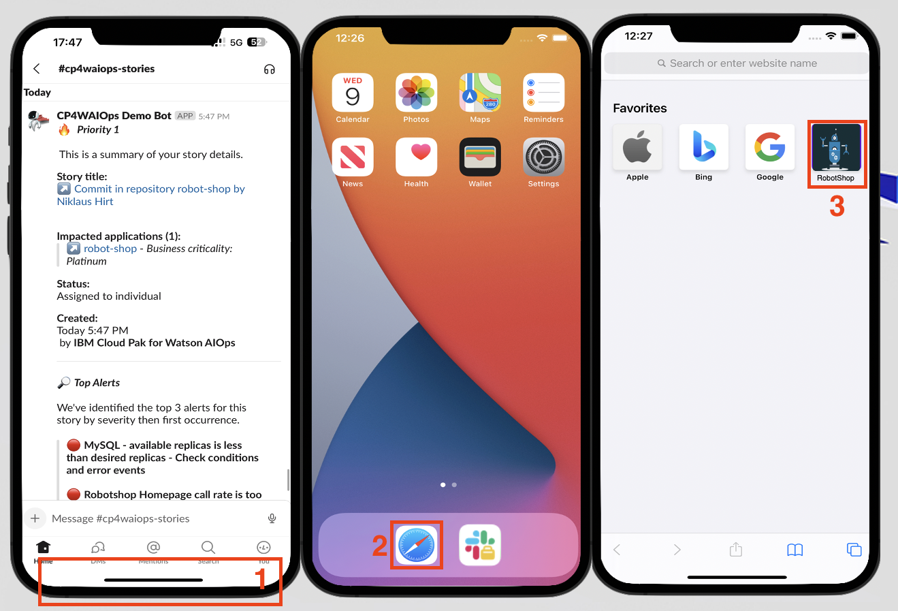

>**🚀 <u>Action</u>**
>
>- Click at the bottom of the phone **(1)**
>
>- Open the Safari Browser **(2)**
>
>- Click on the RobotShop bookmark **(3)**
>

**📣 <u>Narration</u>**
It seems that the application is up but displays an error that it cannot get any ratings.

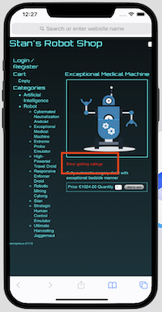

**📣 <u>Narration</u>**

I know that there are many ratings for each of the products that we sell, so when none are displayed, it means that there is a likely problem with the `Ratings` service that may heavily impact client’s purchasing decisions and it may well be a sign of a wider outage.

So now I'm going into my AIOps Incident Management solution to solve the problem as quickly as possible.

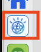

>**🚀 <u>Action</u>**
>
>- Click on the **IBM AIOps** icon in the left menu bar
>

## 2.4 Understanding the incident

### 2.4.1 Open the Incident

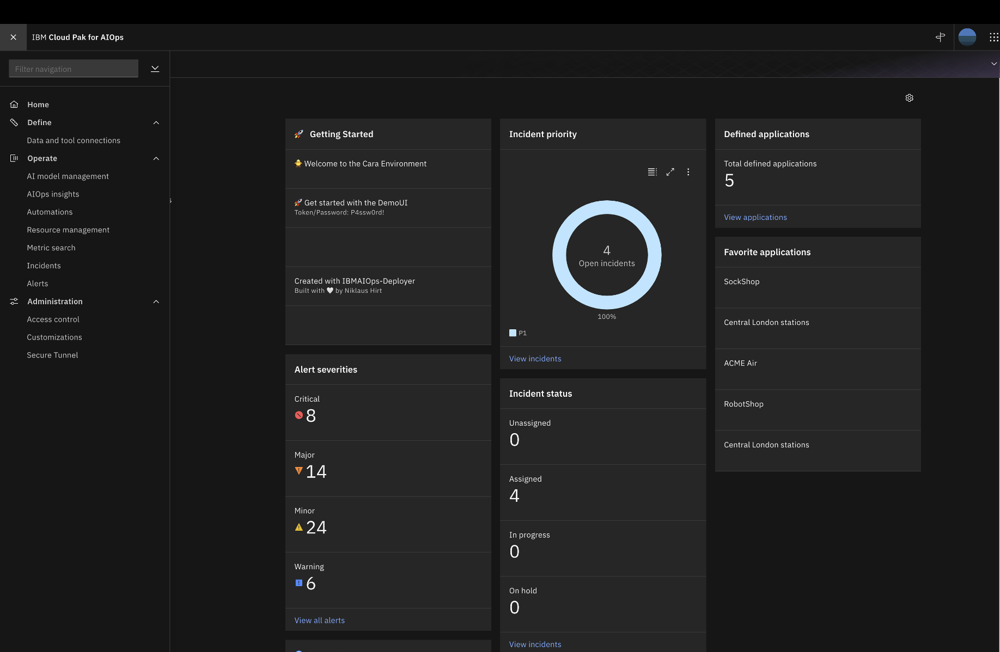  

>**🚀 <u>Action</u>**
>
>- Click the **Hamburger Menu** on the upper left. Click **Incidents**

### 2.4.2 Examining the Incident

**📣 <u>Narration</u>**

We can see that the simulation has created a **Incident**. 

The **Incident** includes grouped information related to the incident at hand. It equates to a classic War Room that are usually put in place in case of an outage. 

The **Incident** contains related log anomalies, topology, similar incidents, recommended actions based on past trouble tickets, relevant events, runbooks, and more.

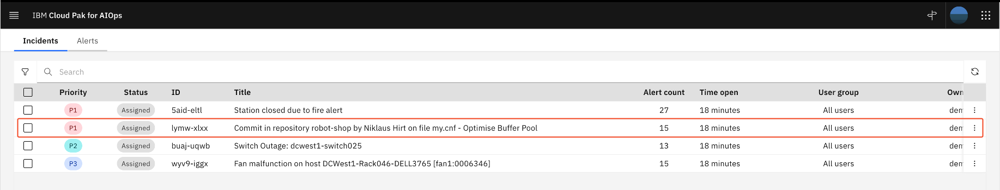

>**🚀 <u>Action</u>**
>
>- Click on the **Incident** `Commit in repository...` 

**📣 <u>Narration</u>**

Now let's have a look at the **Incident**.

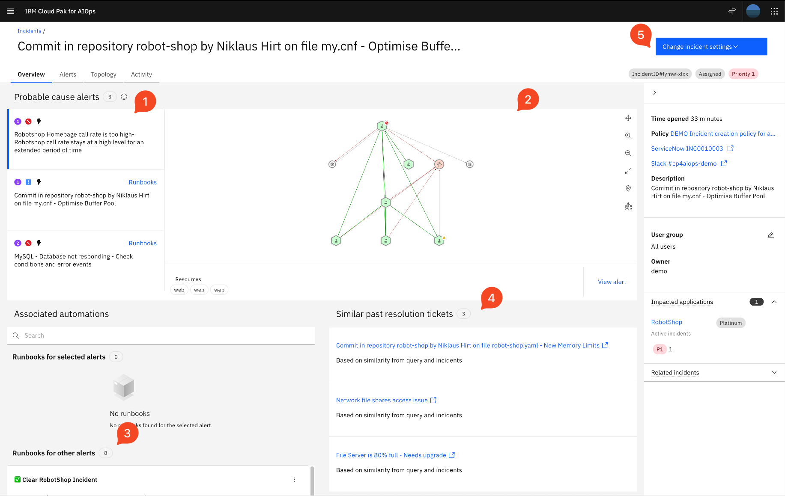

As I said before, the Incident regroups all relevant information concerning the incident at hand that have been identified by IBM AIOps.

1. A list of Alerts that have been identified by IBM AIOps to be the most probable cause
2. The localization of the problem related to the Topology
3. The suggested Runbooks to automatically mitigate the incident
4. Similar Incidents that resemble the incident at hand
5. Status of the Incident - here I can change the status and priority of the incident

### 2.4.3 Acknowledge the Incident

**📣 <u>Narration</u>**

First and before I continue examining the Incident I want to let my colleagues know that I'm working on the incident. So let me set it to In Progress.

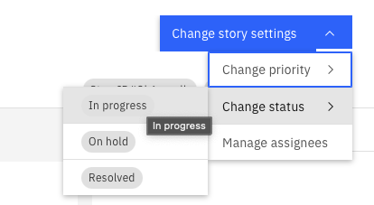  

>**🚀 <u>Action</u>**
>
>- Click on **Change Incident Settings.**
>
>- Select **Change Status.**
>
>- Click on  **In progress**

### 2.4.4 Probable Cause

**📣 <u>Narration</u>**

IBM AIOps is showing me the Alerts that are most likely to be at the heart of the Problem. We call this **Probable Cause**.

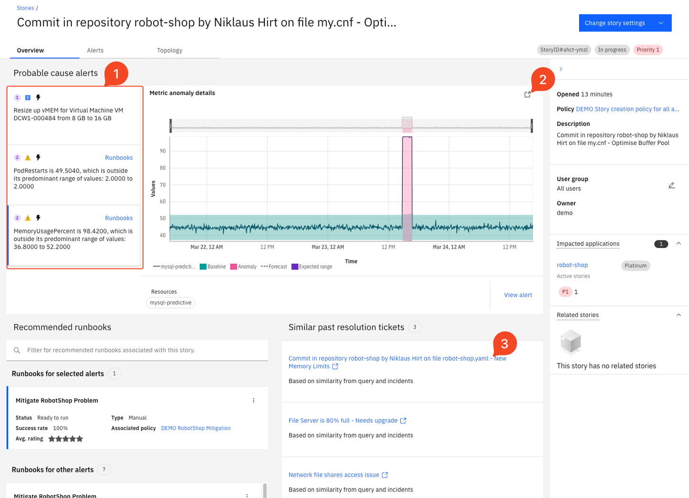

>**🚀 <u>Action</u>**
>
>- Click on `Commit in repository...` in Probable Cause **(1)**. 
>
>- Click on `MySQL - Database...` in Probable Cause **(1)**. 

### 2.4.5 Similar Incidents

**📣 <u>Narration</u>**

Most large organizations use IT Service Management tools to govern processes around IT. Our organization is using ServiceNow for that purpose. Past incidents with resolution information are ingested and analysed by IBM AIOps to train on exisitng tickets and extracting the steps used to fix previous incidents (if documented) and recommend resolutions. This AI model helps you discover historical incidents to aid in the remediation of current problems. 

So for the **Incident**, your team is presented with the top-ranked similar incidents from the past, so no need to manually search for past incidents and resolutions, which is time-consuming.

In this particular example I can see that the problem was related to a GIT Commit that massively reduced the resources on the mysql Database.

Let me check how the problem was resolved for this incident.

>**🚀 <u>Action</u>**
>
>- Click the first **similar resolution ticket** **(2)**  

**📣 <u>Narration</u>**

When I open the ticket in ServiceNow, I see that there has been a similar problem with the the mysql database and a Runbook had been created to mitigate the problem.

  

**❗ <u>Note</u>**:  In the Robot Shop demo scenario, the integration with ServiceNow is simulated with the static content. 

>**🚀 <u>Action</u>**
>
>- Click on the **Resolution Information** Tab

#### Resolution Information

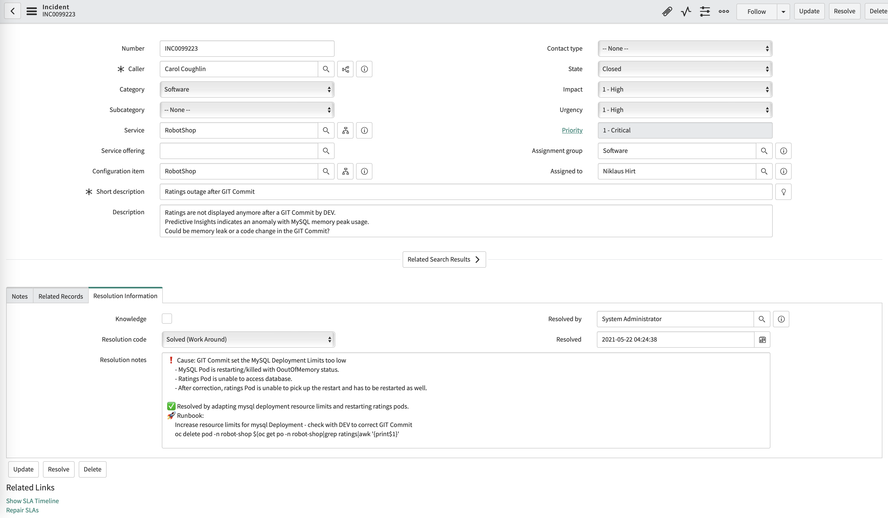  

**📣 <u>Narration</u>**

It seems that it was resolved by changing the mysql deployment and a Runbook had been created to mitigate the problem. To finish up, I will check if the incident was related to an official change.

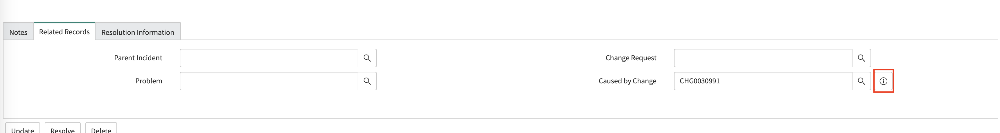

>**🚀 <u>Action</u>**
>
>- Click on the **Related Records** Tab
>
>- Click on the **i** Button next to **Caused by Change**

#### Examine the Change

  

**📣 <u>Narration</u>**

Ok, so now I can see that the problem is related to a Change that aims to reduce the footprint of the mysql database.

As it's still ongoing, chances are high, that the development team recreated a similar problem.

Obviously, in real life I would now start the Runbook to see if it resolves the problem.
But for the sake of the demo, let's dig a little deeper first.

So let me go back to the incident.

>**🚀 <u>Action</u>**
>
>- Close the ServiceNow page by clicking the **IBM AIOps** Icon. 
>

### 2.4.6 Examine the Alerts

**📣 <u>Narration</u>**

Let's have a look at the Alerts.

>**🚀 <u>Action</u>**
>
>- Click on the **Alerts** Tab 

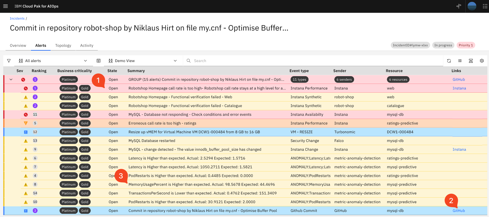  

**📣 <u>Narration</u>**

Notice, that alerts are sorted by time of occurence, and that the AI engine ranked them by relevance. The ones that are likely related to the root cause have smaller numbers and are coloured. Let’s look at the first alert for some more details. 

>**🚀 <u>Action</u>**
>
>- Click on the first Alert in the list **(1)** 

**📣 <u>Narration</u>**

In the **Alert details,** you can see different types of groupings explaining why the specific alert was added to the incident.

#### Scope based grouping

>**🚀 <u>Action</u>**
>
>- Click **Scope-based grouping**. 

**📣 <u>Narration</u>**

Some alerts were added to the incident because they occurred on the same resource within a short period (default is 15 minutes)

#### Topological grouping

>**🚀 <u>Action</u>**
>
>- Click **Topological grouping**. 

**📣 <u>Narration</u>**

Other alerts were grouped because they occurred on the logically or physically related resources. This correlation is using the application topology service that stitches topology information from different sources.

#### Temporal grouping

>**🚀 <u>Action</u>**
>
>- Click **Temporal correlation**. 

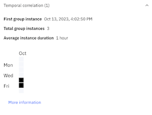

**📣 <u>Narration</u>**

Finally, the temporal correlation adds to the incident events that previously, in history, are known to occur close to each other in the short time window. 

>**🚀 <u>Action</u>**
>
>- Click **More Information**. 

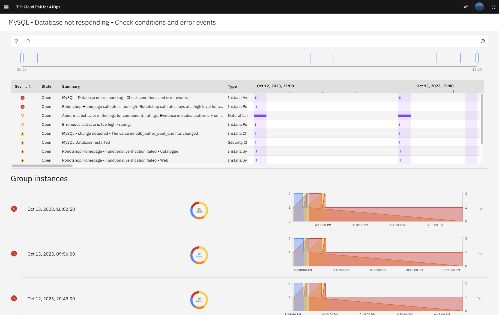

**📣 <u>Narration</u>**

What is most important here is the fact that all these correlations happen automatically – there is no need to define any rules or program anything. In highly dynamic and distributed cloud-native applications this is a huge advantage that saves a lot of time and effort.

>**🚀 <u>Action</u>**
>
>- **Close** the Temporal Detail window by clicking anywhere in the top half. 
>
>- **Close** the Alert details window by clicking on the X at the top right.

### 2.4.7 Incident timeline

  

**📣 <u>Narration</u>**

When trying to understand what happened during the incident, it helps that the alerst are already sorted by occurence time. This allows me to understand the chain of events.

* I can see that the first event was a code change that had been commited to **GitHub**. 

>**🚀 <u>Action</u>** 
>
>- Click on **GitHub ** to open the link **(2)**

**📣 <u>Narration</u>**

I have now confirmation that the Dev team has massively reduced the Buffer Pool Size of my MySQL Database.
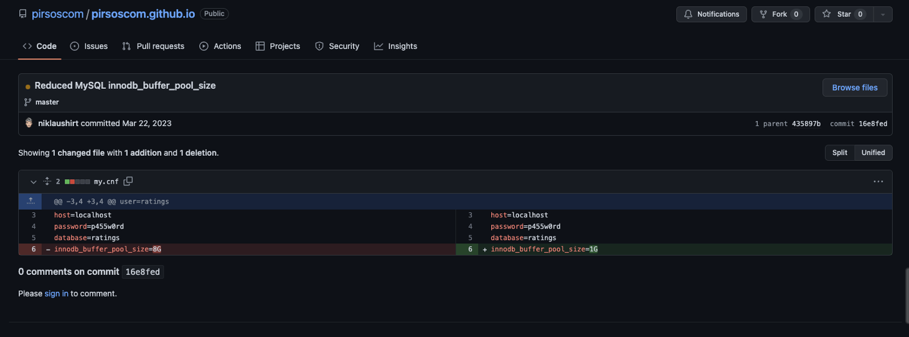  

>**🚀 <u>Action</u>**
>
>- Click anywhere in the Git screen to go back

**📣 <u>Narration</u>**

Other events are confirming the hypothesis:

* I can then see the CI/CD process kick in and deploys the code change to the system detected by the Security Tool (Falco) and 
* **Instana** has has detected the memory size change. 

* Then **Functional Selenium Tests** start failing and 

* **Turbonomic** tries to scale-up the mysql database.

* **Instana** tells me that the mysql Pod is not running anymore, the replicas are not matching the desired state.

  

  But I can also see that there are anomalies in some metrics for my application.

  Let's have a look.

### 2.4.8 Metric Anomalies

**📣 <u>Narration</u>**

* IBM AIOps is capable of collecting metrics from multiple sources and detecting **Metric Anomalies**. It was trained on hundreds or thousands of metrics from the environment and constructs a dynamic baseline (shown in green).

Let's see the details of what is wrong with my metrics.

>**🚀 <u>Action</u>**
>
>- Click on `MemoryUsagePercent is Higher than expected...`.
>

**📣 <u>Narration</u>**

* The graphic suddenly turns red which relates to detected anomaly when the database is consuming a higher amount of memory than usual.

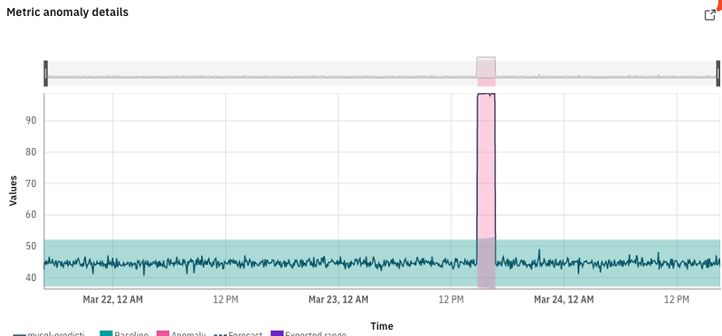

**📣 <u>Narration</u>**

You can display several alerts at the same time to better understand the temporal dependencies

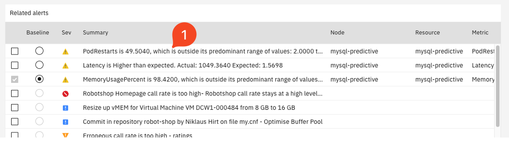

>**🚀 <u>Action</u>**
>
>- In **Related Alerts** click on the line **PodRestarts...** to add an additional alert **(1)**.
>
>- Then click on the line **Transactions per Second...** to add a third alert **(2)**.

**📣 <u>Narration</u>**

Now let's zoom in to better see the anomalies

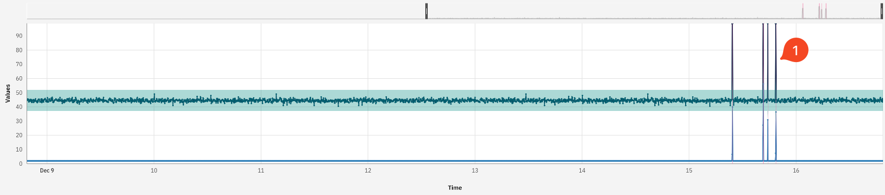

>**🚀 <u>Action</u>**
>
>- Click on the anomaly in the graph to zoom in **(1)**
>
>- Click on the anomaly a second time to show the values

**📣 <u>Narration</u>**

I can clearly see that the incident caused the **Memory Usage** to skyrocket to a constant 100%, there are almost no **Transactions** going through and the **Pods** have been continuously restarted. This is yet another confirmation of the source of the problem.

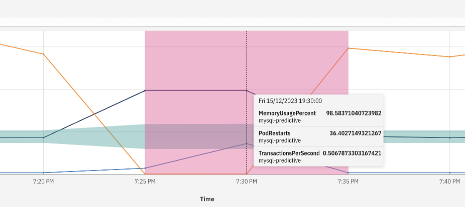

>**🚀 <u>Action</u>**
>
>- Close the Metric anomaly details view by clicking on `Incident Alerts` in the upper left corner. 
> 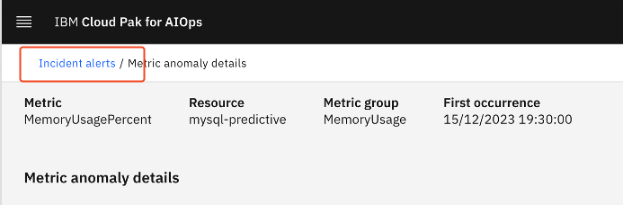

## 2.5 Working with Topology

### 2.5.1 Examining the Alert Topology

>**🚀 <u>Action</u>**
>
>- Click the **Topology** Tab. 

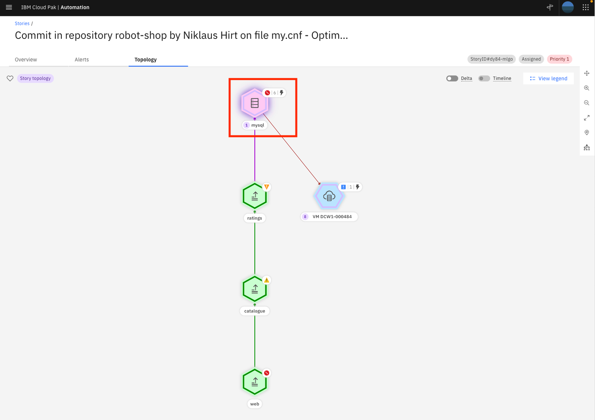

**📣 <u>Narration</u>**

The interface shows the **topology** of the application that is relevant to the incident. IBM IBM AIOps’ topology service delivers a working understanding of the resources that you have in your environment, how the resources relate to each other, and how the environment has changed over time.

You can see that there are some statuses attached to the different resources, marked with colorful dots. Let’s view the details and status of the **mysql** resource with red status. 

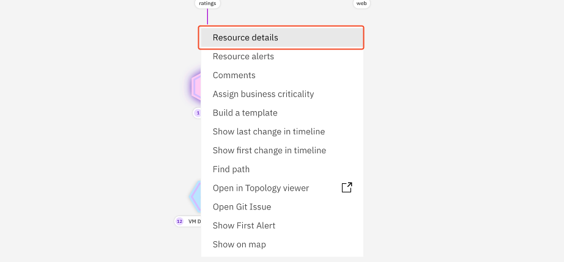  

>**🚀 <u>Action</u>**
>
>- Click on the resource which displays resource name “**mysql**”
>
>- Then, click and select **Resource details.** 
>
>- Click on Tab **Alerts** 

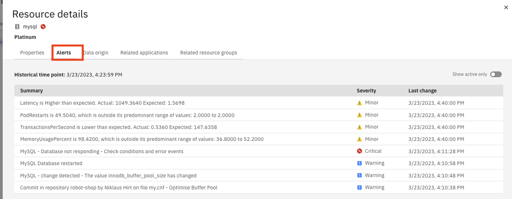

**📣 <u>Narration</u>** 

The topology service provides operations teams with complete up-to-date visibility over dynamic infrastructure, resources, and services. The topology service lets you query a specific resource for details, and other relevant information. Here I can see all Alerts for the mysql database resource for example.

>**🚀 <u>Action</u>**
>
>- Click the cross in the upper right corner to close the details view.
>
>- Click on the **Overview**  Tab.

### 2.5.2 Examining the Topology in detail (optional)

> ##### Instead of going back to Overview you can dig a bit deeper into Topology if it fits the customer interest.

>**🚀 <u>Action</u>**
>
>- Click on the different Tabs to show the information (Related Applications, Neighbor Resources, ...)

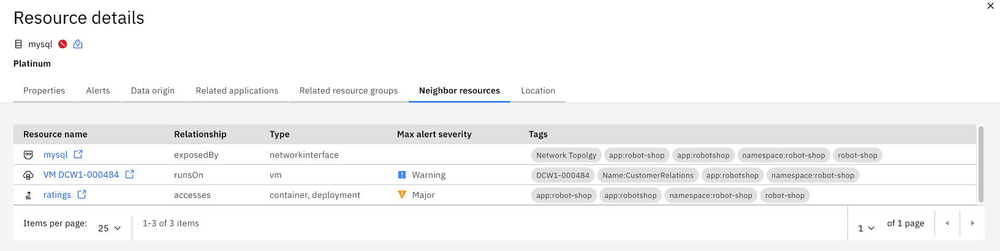

**📣 <u>Narration</u>** 

The topology service provides me with additional information for the component I'm looking at, such as the Applications it's part of or the neighbouring resources.

>**🚀 <u>Action</u>**
>
>- Click on the `Location` Tab

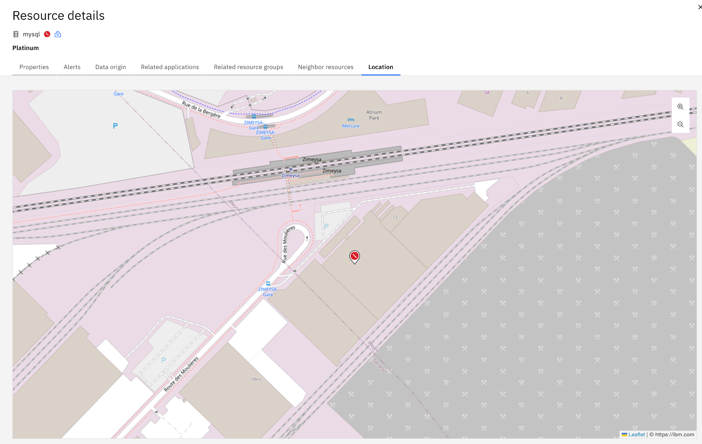

**📣 <u>Narration</u>** 

If the resources contains geographical information (Longitude, Latitude) I can also see them on a map.

>**🚀 <u>Action</u>**
>
>- Click on the Map to zoom in

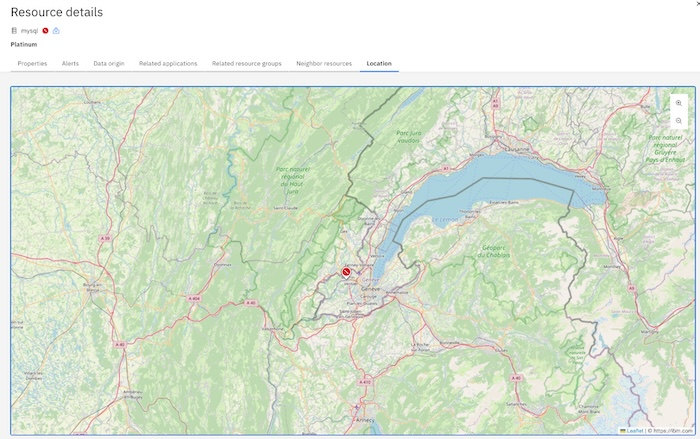

**📣 <u>Narration</u>** 

Here I can see that the Database is being hosted in the IBM Datacenter in Meyrin near Geneva in Switzerland.

>**🚀 <u>Action</u>**
>
>- Click the cross in the upper right corner to close the details view.
>
>- Click on the resource which displays resource name “**mysql**”
>
>- Then, click and select **Open Git Issue** 

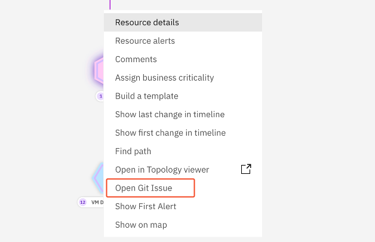

**📣 <u>Narration</u>** 

IBM AIOps also allows me to create custom menus to integrate with my existing tools. Here I can open a Git Issue and pre-filling it with the Alert information. 

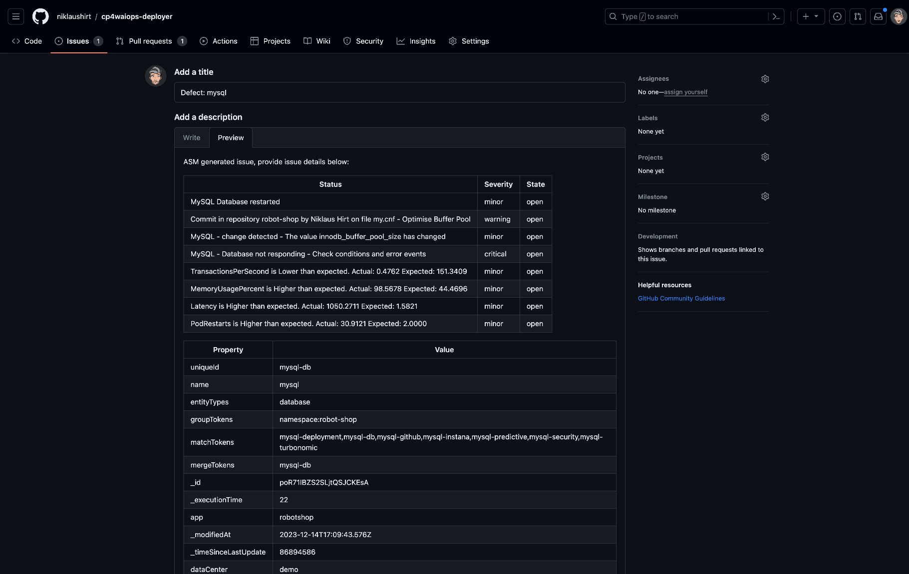

>**🚀 <u>Action</u>**
>
>- Click anywhere to close the Git Issue.

>**🚀 <u>Action</u>**
>
>- Click on the resource which displays resource name “**mysql**”
>
>- Then, click and select **Show last change in timeline** 

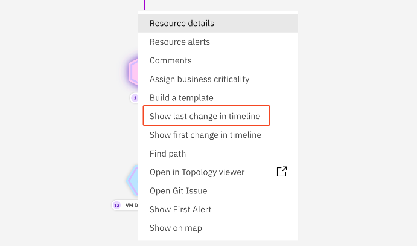

**📣 <u>Narration</u>** 

IBM AIOps also keeps a historic view of the events that happened for a element of the topology. 

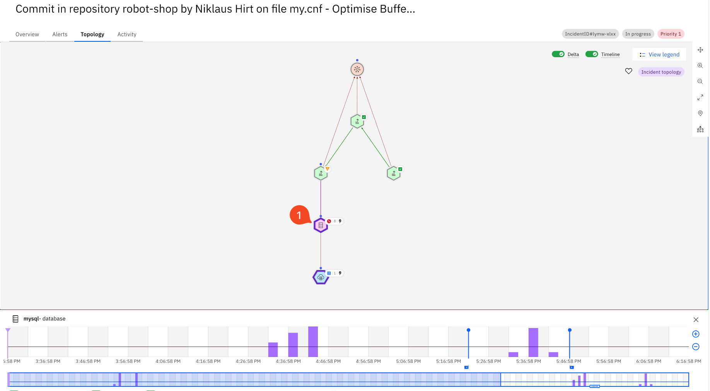

**📣 <u>Narration</u>** 

I can easily identify the alerts and changes that happened over time for my resource (before / after).

>**🚀 <u>Action</u>**
>
>- Click the cross in the upper right corner to close the details view.
>
>- Click on the **Overview**  Tab.

### 2.5.3 Examining Applications (optional)

> ##### Instead of going back to Overview you can dig a bit deeper into Topology if it fits the customer interest.

>**🚀 <u>Action</u>**
>
>- Click the cross in the upper right corner to close the details view.
>
>- Click the **Hamburger Menu** on the upper left. Click **Resource Management**

**📣 <u>Narration</u>** 

Applications consists of a collection of resourcs to best represent a specific business application or service.

>**🚀 <u>Action</u>**
>
>- Click the RobotShop Application **(1)**.

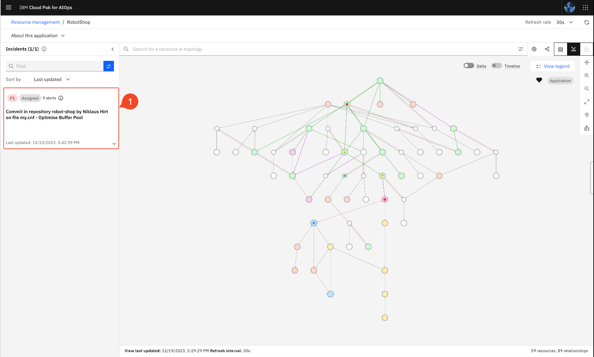

**📣 <u>Narration</u>** 

Those resources make up the complete Topology of the Application.

>**🚀 <u>Action</u>**
>
>- Click the Alert **(1)**.

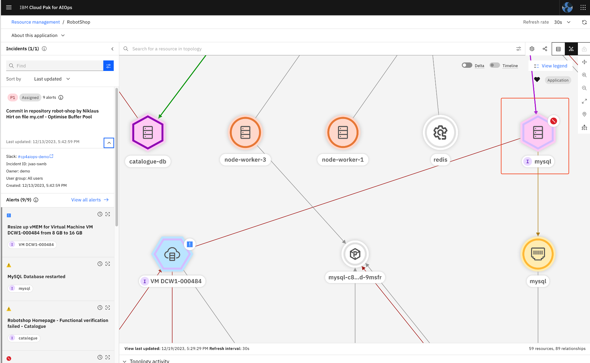

**📣 <u>Narration</u>** 

And I can examine all Incidents in the context of my Application.

>**🚀 <u>Action</u>**
>
>- Click the `mysql` Database.

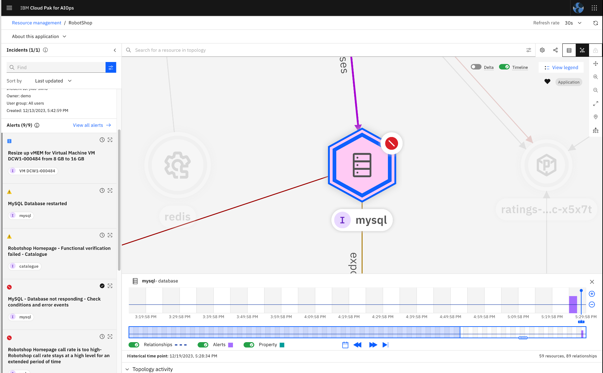

**📣 <u>Narration</u>** 

In this case I can find my current Incident and the part of the Topology that is affected by it.

>**🚀 <u>Action</u>**
>
>- Click anywhere to go back to the Resource Management page.

### 2.5.4 Searching for resources (optional)

>**🚀 <u>Action</u>**
>
>- Click in the search bar at the top **(1)**.

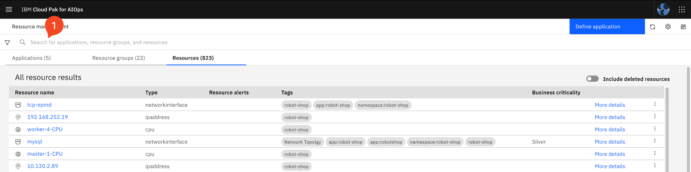

**📣 <u>Narration</u>** 

It is very easy and straightforward to search for resources in IBM AIOps.

>**🚀 <u>Action</u>**
>
>- Click `mysql`.

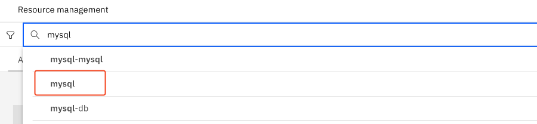

**📣 <u>Narration</u>** 

By looking for a specific name, term or tag.

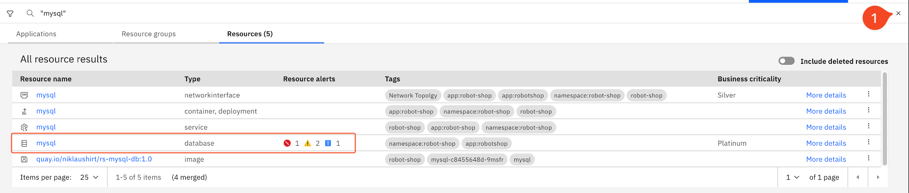

**📣 <u>Narration</u>** 

In this case I can find my MySQL Database with the indication that there are some Alerts present on the resource.

>**🚀 <u>Action</u>**
>
>- Click the `mysql` Database.

**📣 <u>Narration</u>** 

From here I can go to the resource details that I have already explored before, so let's head back.

>**🚀 <u>Action</u>**
>
>- Click on the X in the top right corner to go back.
>
>- ⚠️ Make sure you are on the **Location** Tab when doing this.

### 2.5.5 Searching for geospatial resources (optional)

>**🚀 <u>Action</u>**
>
>- Click on the funnel at the top left **(1)**.

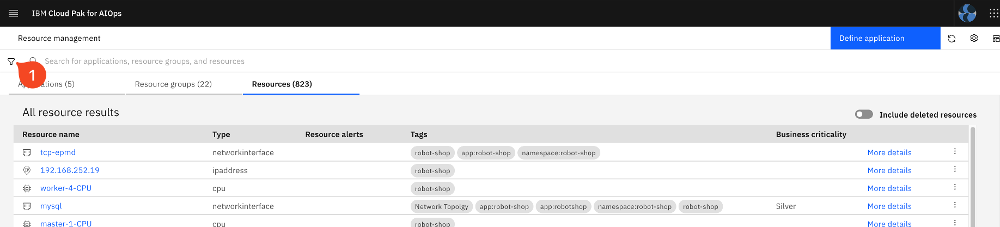

**📣 <u>Narration</u>** 

It is also very easy and straightforward to search for resources by geography.

>**🚀 <u>Action</u>**
>
>- Click `Geospatial Resources` **(1)**.
>
>- Click `Scope` and select `Within Area` **(2)**.
>
>- Click `Select Area` **(3)**.
>
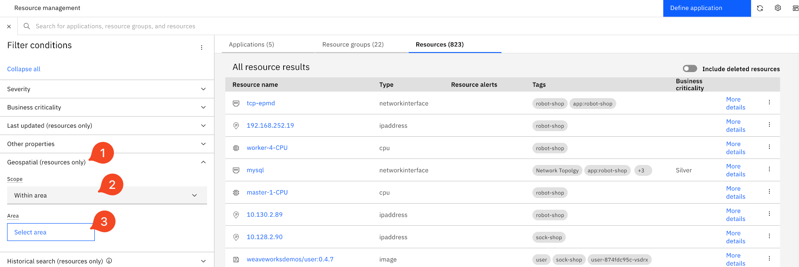

**📣 <u>Narration</u>** 

I can as an example search all resources in a certain perimeter.
For this I have to define a search area.

>**🚀 <u>Action</u>**
>
>- Click several times anywhere in the map to define the area.
>
>- You might want to train a little bit to not be completely off when clicking.

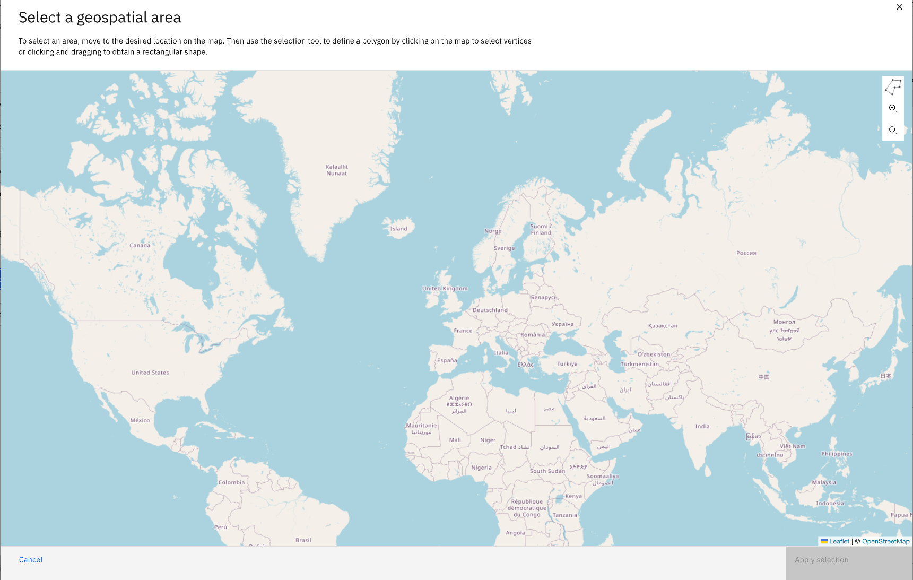

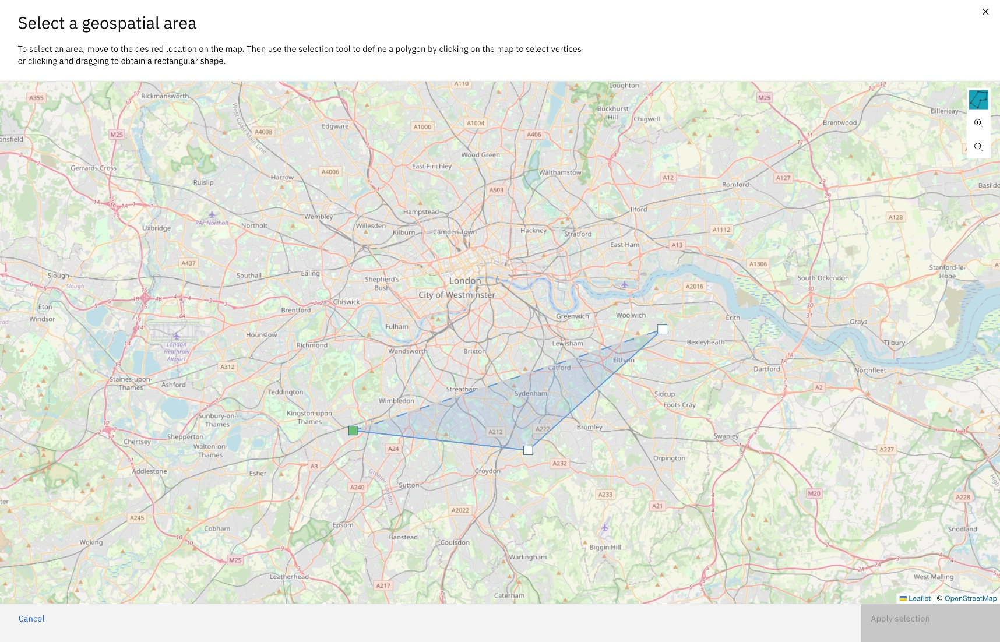

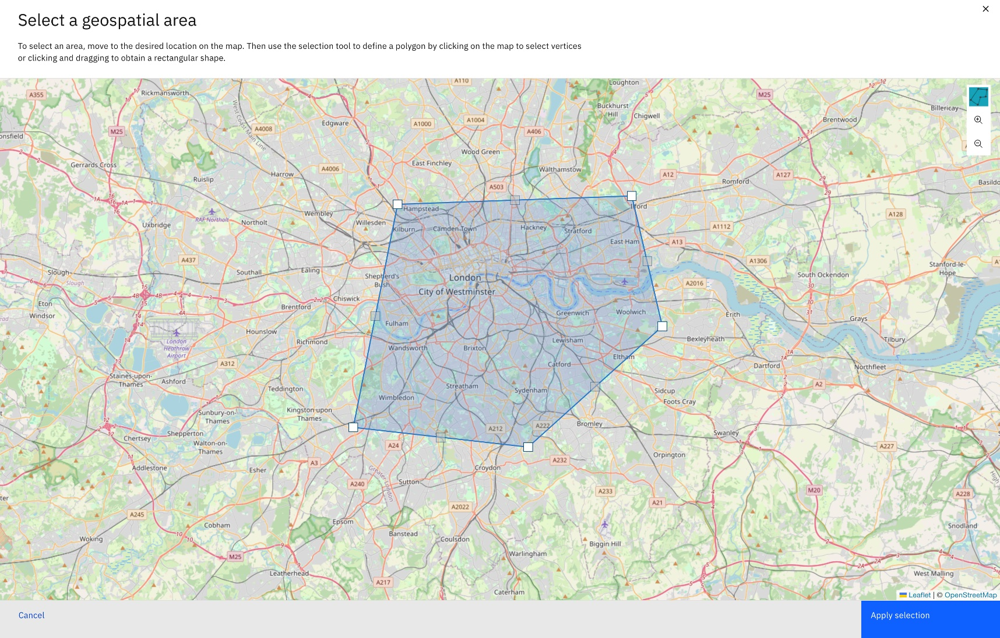

>**🚀 <u>Action</u>**
>
>- Click `Apply Selection`.

**📣 <u>Narration</u>** 

In this case I get a list of all London Underground stations that are in the designated ares.

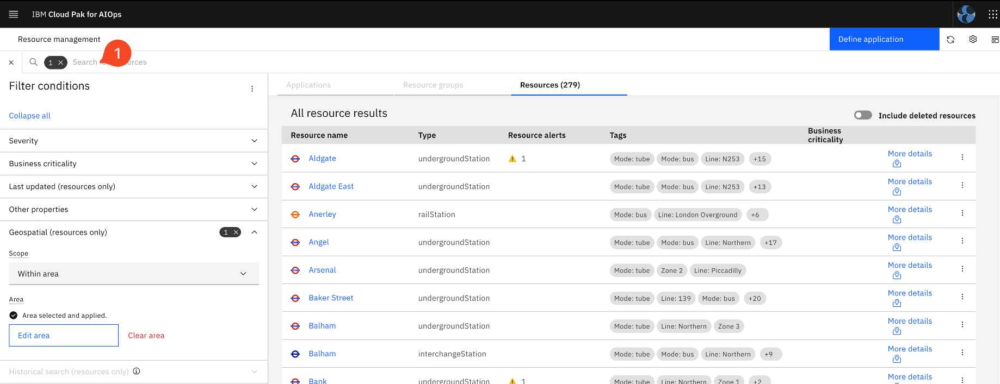

>**🚀 <u>Action</u>**
>
>- Click in the search bar at the top **(1)**.

**📣 <u>Narration</u>** 

Now let's narrow it down a bit.

>**🚀 <u>Action</u>**
>
>- Click on `Mile End`.

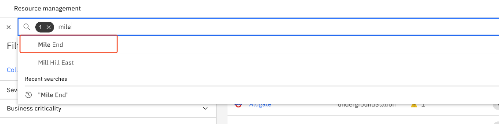

>**🚀 <u>Action</u>**
>
>- Click on `Mile End` **(1)**.

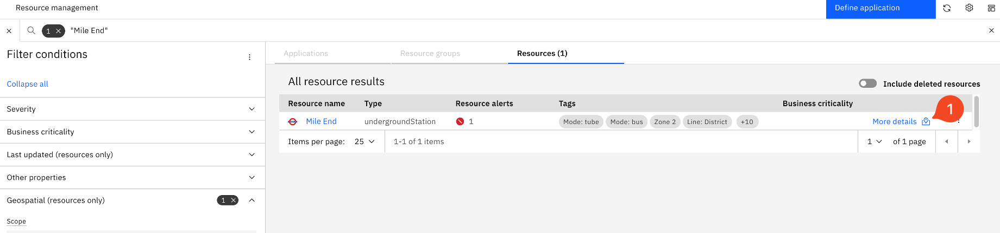

>**🚀 <u>Action</u>**
>
>- Click on the station Pin on the Map **(1)**.

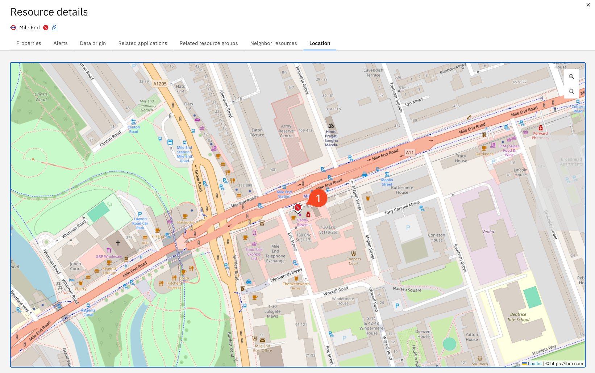

**📣 <u>Narration</u>** 

Here I can explore the resource details for the Mile End Tube Station.

>**🚀 <u>Action</u>**
>
>- Click on the `-` Magnifying Glass in the upper right corner **(1)**.

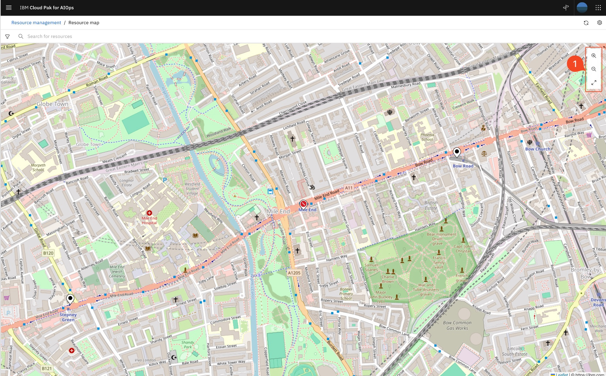

**📣 <u>Narration</u>** 

From here I can zoom in and out of the map to get a more global understanding.
For example I can see that my first problem is located at Miles end in the North East of London **(1)**.
But there seems to be an issue also near the London Eye **(2)**.

>**🚀 <u>Action</u>**
>
>- Click on the circle that says `40` **(2)**.

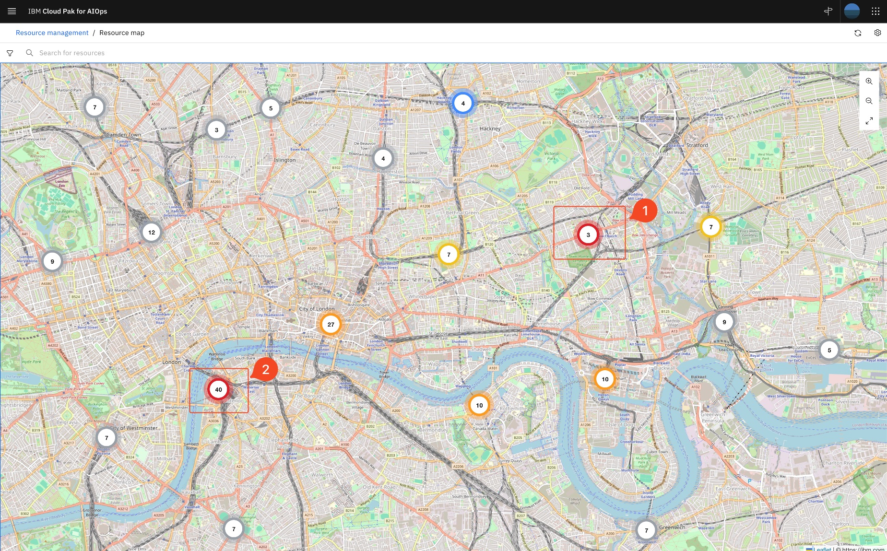

**📣 <u>Narration</u>** 

It seems that I also have a problem in one of my London Datacenters. Let me take a look.

>**🚀 <u>Action</u>**
>
>- Click on the Host **(1)**.

**📣 <u>Narration</u>** 

Seems that there is also an incident with a Switch Outage affecting the SockShop application. But this one is not in my application portfolio and a story for another time.

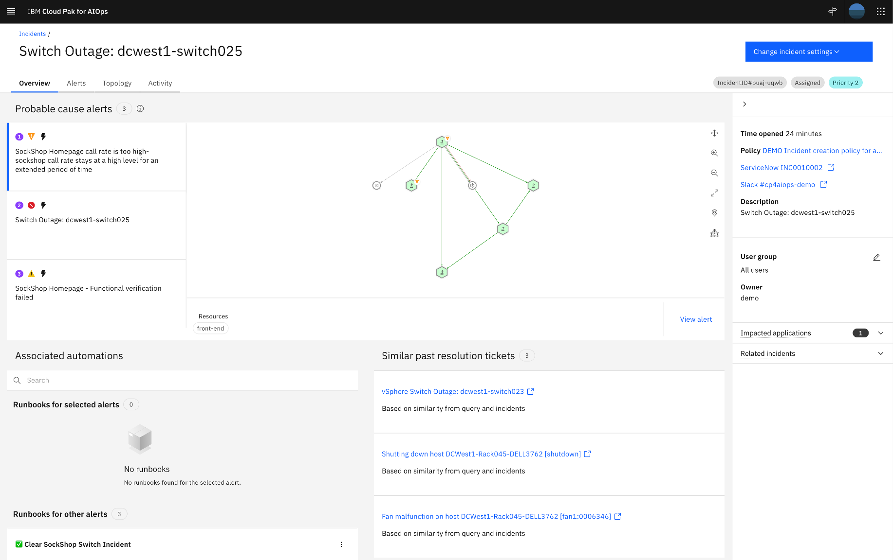

>**🚀 <u>Action</u>**
>
> To go back to the initial storyline:
>
>- Click the **Hamburger Menu** on the upper left. Click **Incidents**
>
>- Click on the **Incident** `Commit in repository...` 
>

## 2.6 Resolving the incident

### 2.6.1 Fixing the problem with runbook automation

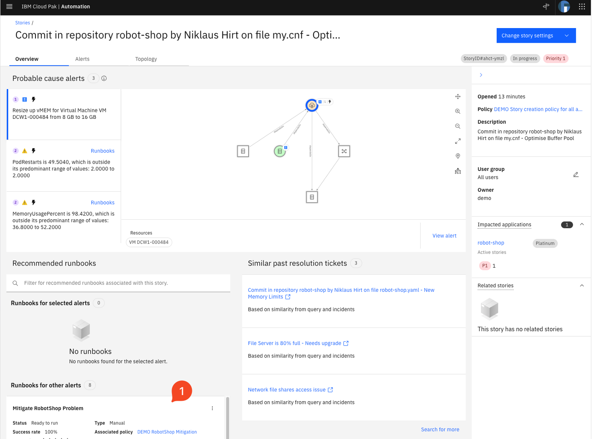

**📣 <u>Narration</u>**

Now that we know what the problem is, let’s correct what has happened. A runbook has been automatically identified but have not been executed. Runbooks are guided steps that IT operations teams use to troubleshoot and resolve problems. Some organizations might call these standard operating procedures or playbooks. When an incident occurs, IBM IBM AIOps matches an appropriate runbook to the problem. The runbook can be set to run automatically when it is matched to an incident, or it can run with user approval and participation. 

**📣 <u>Narration</u>**

Let’s execute the Runbook.

>**🚀 <u>Action</u>**
>
>- Click on the Runbook **(1)**
>
>- Click **Start Runbook**.

>**🚀 <u>Action</u>**
>
>- Click **Run** in Step 1.

**📣 <u>Narration</u>**

The Runbook that I just started kicks off a Playbook on Ansible Tower. I can follow the execution as it connects to the cluster and then scales up memory for the MySQL deployment.

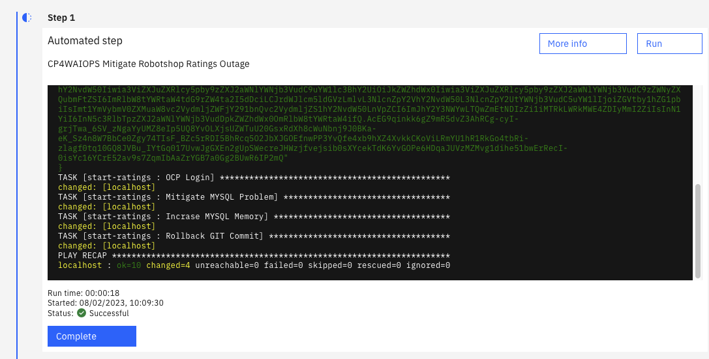

**📣 <u>Narration</u>**

Before confirming that the runbook worked as expected, I should check the RobotShop application to see if it is working as expected.

>**🚀 <u>Action</u>**
>
>- When finished, click **Complete**.
>
>- Open the RobotShop application by clicking on the **Firefox** Icon in the left menu
>
> 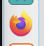
> 

>**🚀 <u>Action</u>**
> 
>- Click on any Robot **(1)**
>
>- Show that ratings are correctly shown **(2)**

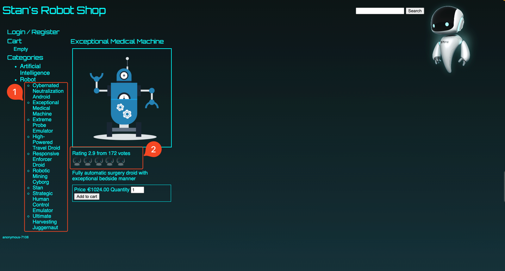

>**🚀 <u>Action</u>**
>
>- Go back by clicking on the **IBM AIOps** Icon in the left menu

**📣 <u>Narration</u>**

So the runbook has resolved the problem. When I tell IBM AIOps that the Runbook worked, it will learn over time to prioritize and suggest more relevant Runbooks.

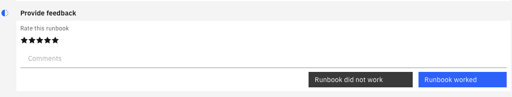

>**🚀 <u>Action</u>**
>
>- Rate the Runbook
>
>- Then click **Runbook Worked**.

### 2.6.2 Resolve the Incident

>**🚀 <u>Action</u>**
>
>- Select **Change Status.**
>
>- Click on  **Resolved**

  

**📣 <u>Narration</u>**

So now as we have resolved the problem,  I will inform the development team of the problem by reopening the ServiceNow ticket and by closing the Incident. 

>**🚀 <u>Action</u>**
>
>- Click anywhere to go back to the list of Incidents
>
>- Click anywhere to conclude the demo

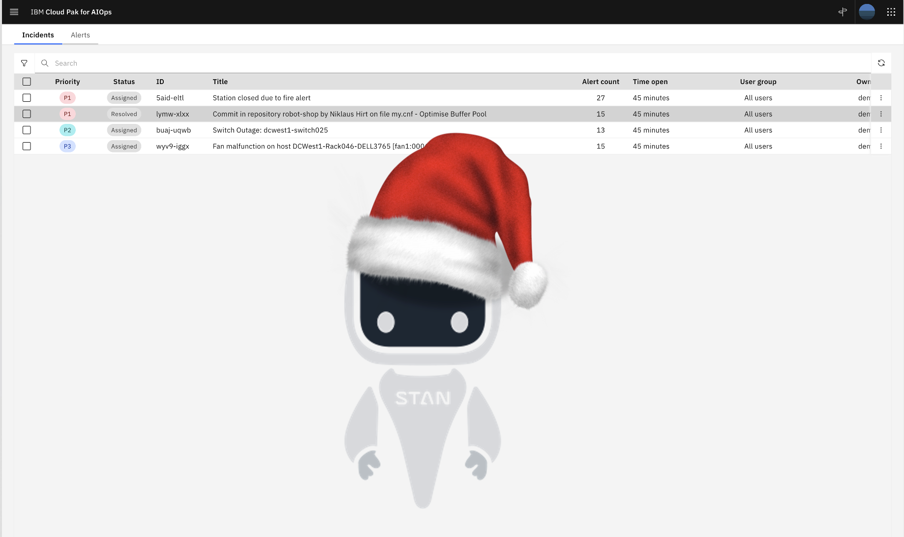  

**📣 <u>Narration</u>**

##### So to conclude: The problem is solved, the RobotShop Application is running as expected and `Christmas is saved`. 

# Demonstration summary
**📣 <u>Narration</u>**

Today, I have shown you how IBM AIOps can assist the SRE/Operations team to identify, verify, and ultimately correct an issue with a modern, distributed application running in a cloud-native environment. The presented solution provides automatic application topology discovery, anomaly detection both with metrics and logs, and sophisticated methods of correlation of events coming from different sources. 

****